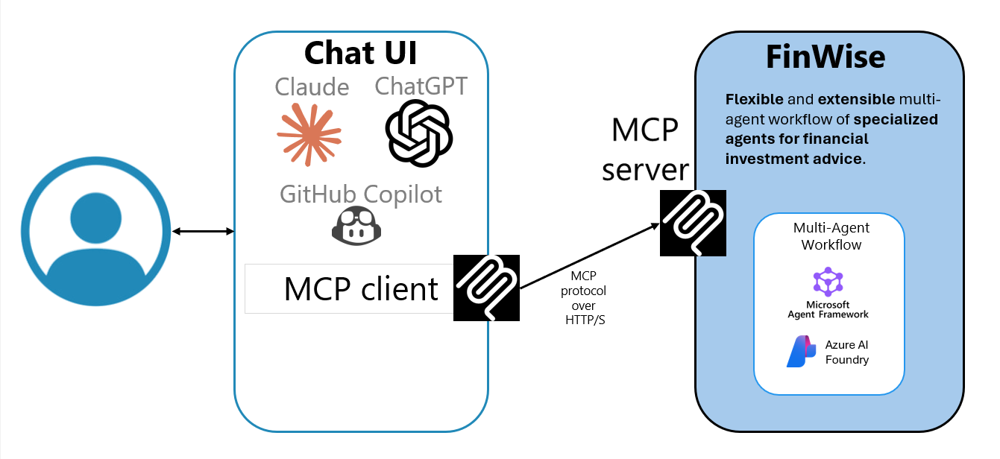
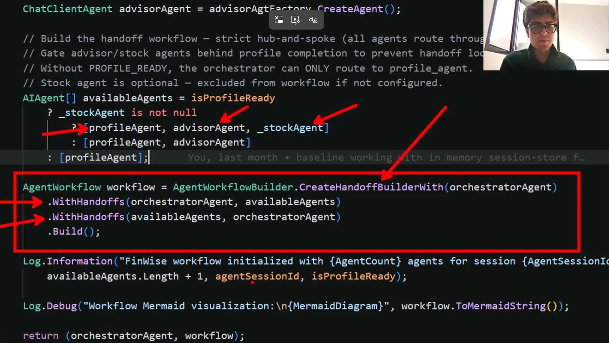
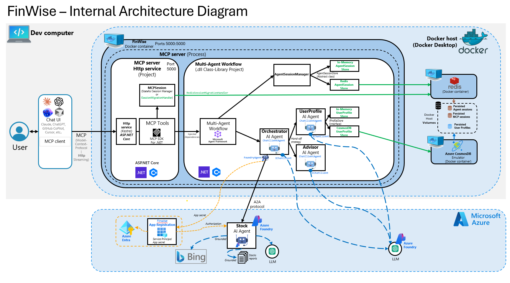
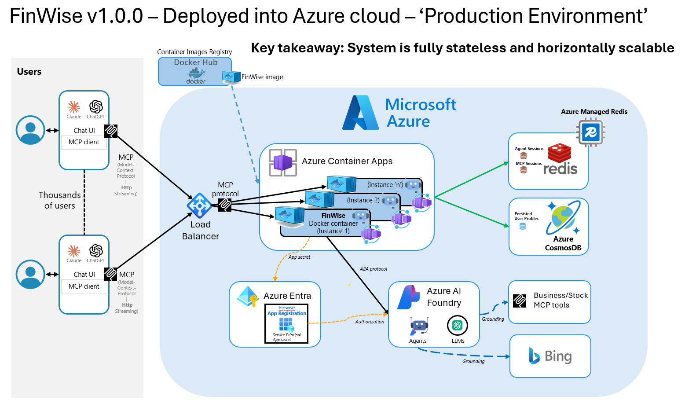

# 💰 FinWise

**A Multi-Agent Investment Assistant for Smarter Financial Decisions**

This is how FinWise works at a high level.
Users interact through any chat interface that supports MCP.
The request is routed into a multi-agent workflow where specialized agents handle different tasks.
The system is protocol-based, which means it is not tied to a specific UI or platform.
This makes it flexible, extensible, and easy to integrate with different AI ecosystems.

For instance, you can use FinWise as an end user in the Claude app. For development testing, you can also test it with GitHub Copilot:



## 🎬 Demo Video
 
> Watch a demo-video of FinWise covering the user experience, architecture and major code highlights!
>
> <a href="https://1drv.ms/v/c/368861ad43af4978/IQAxR6uwHTIXTJi0Sw5YsIQsAcWQtxkonqKVJe0riojnHjw?e=MiQGTQ">
>   
> </a>

## Internal Architecture

FinWise is an [MCP](https://modelcontextprotocol.io/) server built with .NET 10 and the [Microsoft Agent Framework](https://learn.microsoft.com/en-us/microsoft/agents/) that orchestrates four AI agents via hub-and-spoke handoffs:

| Agent | Role |
|-------|------|
| 🎯 **OrchestratorAgent** | Silent router — delegates to the right specialist |
| 👤 **ProfileAgent** | Collects and manages user investment profiles |
| 📊 **AdvisorAgent** | Personalized investment advice (once profile is ready) |
| 📈 **StockSpecializedAgent** | Real-time stock research via Azure AI Foundry |

The multi-agent workflow, orchestrator, profile, and advisor agents run in Docker inside the FinWise MCP container.
The stock-specialized agent is more advanced. It is grounded with additional annual reports and Bing Search, and it is deployed in Azure AI Foundry.
It communicates remotely over A2A, which is handled transparently by the Microsoft Agent Framework via `Microsoft.Agents.AI.Foundry`.



### 🛠️ Tech Stack

| | Technology |
|---|---|
| **Runtime** | .NET 10, C# latest |
| **AI** | Microsoft Agent Framework + Azure AI Foundry |
| **Agents** | Microsoft.Agents.AI (NuGet) |
| **Protocols** | MCP + A2A |
| **Storage** | Azure CosmosDB (profiles), Redis (sessions) |
| **Logging** | Serilog (structured) |
| **Testing** | xUnit, FluentAssertions, Moq |

---

## Infrastructure "Production" Architecture

This is the final architecture deployed in Azure Cloud.
The system is fully stateless, with all data stored externally.
It supports horizontal scaling through multiple instances of FinWise Docker Container at Azure Container Apps, demonstrating a production-ready infrastructure.



## 🚀 Quick Start

### Prerequisites

- 🐳 [Docker Desktop 4.22+](https://www.docker.com/products/docker-desktop/) (Docker Compose v2.20+) — required for both options. The `include:` directive in `docker-compose.yml` requires Compose v2.20 or later.
- 🔧 [.NET 10 SDK](https://dotnet.microsoft.com/download) — only for Mode B and running tests
- 🔑 Azure AI Foundry credentials (if not provided the workflow will still work without the stock specialized agent)

### Running the MCP Server

FinWise supports four deployment modes — **A & B for local development**, **C & D when you're ready for Azure**:

| | Mode | Server runs as | Data stores | Best for |
|---|------|---------------|-------------|----------|
| 🐳 | **Mode A: Full Docker Stack** | Docker container | Local CosmosDB emulator + Redis | Quick start — one command, no .NET SDK needed |
| 🔧 | **Mode B: .NET Process** | `dotnet run` on host | Local CosmosDB emulator + Redis | Development & debugging with hot reload |
| ☁️ | **Mode C: Docker → Azure DBs** | Docker container | Azure Cosmos DB + Azure Managed Redis | Testing against real Azure databases locally |
| 🌐 | **Mode D: Full Azure Cloud** | Azure Container Apps | Azure Cosmos DB + Azure Managed Redis | Production deployment, scale-out |

> 💡 Modes A & B use local emulators — no Azure subscription needed, except for AI Foundry. Modes C & D require Azure database credentials (see `.env.azure.template`).

---

#### 🐳 Mode A: Full Docker Stack (recommended for quick start)

Everything runs in Docker — one command, no .NET SDK required on the host.

The Docker Compose setup is split into three files:

```
docker-compose.yml              ← Full local stack (extends server + includes infra)
docker-compose.finwise.yml      ← Server only (single source of truth)
docker-compose.infra.yml        ← Infra only (CosmosDB emulator + Redis)
```

1. **Create a `.env` file** from the template (secrets are never committed):
   ```powershell
   Copy-Item .env.template .env
   # Edit .env with your Azure OpenAI credentials
   ```

   ⚠️ **Why is `.env` needed?** Docker Compose uses `.env` as the default source for `${VAR}` substitution in compose files. Mode B (`dotnet run`) doesn't need `.env` because the .NET process reads system env vars directly. See [Environment Variable Precedence](#-environment-variable-precedence-docker-compose-vs-os) below for important details on how `.env` and OS-level variables interact.

2. **Start the full stack**:
   ```powershell
   # Starts CosmosDB emulator, Redis, and FinWise server
   docker compose up -d --build
   ```

3. **Verify all services are healthy**:
   ```powershell
   docker compose ps
   ```

4. **View logs**:
   ```powershell
   docker compose logs -f finwise-mcp-server
   ```

The MCP server is available at **http://localhost:5000/mcp**.

> ⏹️ **Stop**: `docker compose down` · **Stop + clear data**: `docker compose down -v`

---

#### 🔧 Mode B: .NET Process (recommended for development/debugging)

Run infrastructure in Docker but the MCP server as a local .NET process — enables debugging, hot reload, and faster iteration.

1. **Set required environment variables** as system or user env vars (see [Environment Variables](#-environment-variables) below).

2. **Start infrastructure only** (without the MCP server container):
   ```powershell
   # (a) Use the dedicated infrastructure-only compose file
   docker compose -f docker-compose.infra.yml up -d

   # (b) Cherry-pick services from the full compose file (only starts the named services — server is NOT started)
   docker compose up -d finwise-cosmosdb-emulator finwise-redis

   # (c) Start only Redis (use with ForceInMemoryData=false + Redis enabled, CosmosDB disabled)
   docker compose up -d finwise-redis
   ```

3. **Build and run the MCP server**:
   ```powershell
   dotnet build FinWise.slnx
   dotnet run --project src/FinWise.McpServer/
   ```

The MCP server starts at **http://localhost:5000/mcp**.

> 💡 By default `appsettings.json` sets `ForceInMemoryData: true` — no Docker infrastructure needed. To use persistent stores, set `FINWISE_FORCE_IN_MEMORY_DATA=false` and enable the individual stores (`FINWISE_COSMOSDB_ENABLED`, `FINWISE_REDIS_ENABLED`).

---

#### ☁️ Mode C: Docker Container → Azure Databases

Run the FinWise server in a local Docker container while connecting to **Azure Cosmos DB** and **Azure Managed Redis** in the cloud.

1. **Create both `.env` files** from the templates:
   ```powershell
   Copy-Item .env.template .env
   Copy-Item .env.azure.template .env.azure
   # Edit both files with your credentials
   ```

2. **Start the server container**:
   ```powershell
   docker compose -f docker-compose.finwise.yml --env-file .env --env-file .env.azure up -d --build
   ```

The MCP server is available at **http://localhost:5000/mcp**.

> 📖 See [specs/05-architecture-and-technologies-v1.0.0.md](specs/05-architecture-and-technologies-v1.0.0.md) §7 for Azure database configuration details.

---

#### 🌐 Mode D: Full Azure Cloud (Azure Container Apps)

Deploy FinWise to **Azure Container Apps** using the published Docker Hub image: `finwiseproject/finwise-mcp-server:1.0.1`. ACA pulls the image, injects environment variables, and exposes the MCP endpoint at `https://<app-name>.<env-id>.<region>.azurecontainerapps.io/mcp`.

This mode has been validated with **5 container replicas** — all E2E tests passing with zero session affinity required (Redis-backed sessions enable true scale-out).

> 📖 See [specs/05-architecture-and-technologies-v1.0.0.md](specs/05-architecture-and-technologies-v1.0.0.md) §8 for the full Azure Container Apps deployment guide.

---

#### 🐳 Docker Compose Variants

| Mode | Scenario | Command | Env file |
|------|----------|---------|----------|
| **A** | Full local stack (infra + server) | `docker compose up -d --build` | `.env` (auto-read) |
| **B** | Infrastructure only (for `dotnet run`) | `docker compose -f docker-compose.infra.yml up -d` | — |
| **C** | Server only → Azure databases | `docker compose -f docker-compose.finwise.yml --env-file .env --env-file .env.azure up -d` | `.env` + `.env.azure` |

> 💡 Mode D uses Azure Container Apps — no Docker Compose needed. The image is pulled directly from Docker Hub by ACA.

> 💡 For Azure-hosted databases, copy `.env.azure.template` to `.env.azure` and fill in your Azure CosmosDB/Redis credentials.

---

### 🔌 Connect an MCP Client

| Client | Setup |
|--------|-------|
| **VS Code** | The repo includes [.vscode/mcp.json](.vscode/mcp.json) — open the workspace and use `FinWise-Orchestrator-MCP` from Copilot Chat |
| **Claude Desktop** | Add `http://localhost:5000/mcp` as an MCP server like in this file: [Claude Desktop MCP Config file](./client-apps-config/Claude-Client-App/claude_desktop_config.json) |
| **Other clients** | Point any MCP client to `http://localhost:5000/mcp` |

---

## 🧪 Testing

All tests are categorized with `[Trait("Category", "...")]` for selective execution:

```powershell
# --- By category (recommended) ---
dotnet test --filter "Category=Unit"                    # No infra needed
dotnet test --filter "Category=Integration"             # Needs Docker infra running
dotnet test --filter "Category=Container"               # Needs full Docker stack (Mode A)
dotnet test --filter "Category=Unit|Category=Integration"  # Combine categories

# --- With environment-specific settings ---
dotnet test --filter "Category=Integration" --settings test.docker-local.runsettings

# --- By project (traditional) ---
dotnet test tests/FinWise.MultiAgentWorkflow.UnitTests/
dotnet test tests/FinWise.CosmosDb.IntegrationTests/
dotnet test tests/FinWise.McpServer.ContainerTests/
```

### Test Categories

| Category | What it needs | Tests |
|----------|--------------|-------|
| `Unit` | Nothing | Workflow, session, agent logic |
| `Integration` | Docker infra or Azure credentials | CosmosDB, Redis, StockAgent, MCP E2E |
| `Container` | Full Docker stack (Mode A) | Docker-specific validation |

### Run Settings

| File | Purpose | Usage |
|------|---------|-------|
| `test.runsettings` | Base settings (results directory) | Default — auto-applied via `tests/Directory.Build.props` |
| `test.docker-local.runsettings` | Local Docker infra env vars | `dotnet test --settings test.docker-local.runsettings` |

> 💡 Tests use `[SkippableFact]` — they skip gracefully when their infrastructure isn't available.

### Running Integration Tests (local Docker infra)

Start the CosmosDB emulator and Redis, then run integration tests:

```powershell
# 1. Start infrastructure
docker compose -f docker-compose.infra.yml up -d

# 2. Wait until healthy
docker compose -f docker-compose.infra.yml ps

# 3. Run integration tests with local Docker settings
dotnet test FinWise.slnx --filter "Category=Integration" --settings test.docker-local.runsettings
```

### Running Container Tests (full Docker stack)

Start the full stack (infra + FinWise server container), then run container tests:

```powershell
# 1. Start full stack
docker compose up -d --build

# 2. Wait until healthy
docker compose ps

# 3. Run container tests
dotnet test FinWise.slnx --filter "Category=Container"
```

---

## 📁 Project Structure

```
├── .github/
│   └── workflows/
│       └── ci.yml                           # CI pipeline (GitHub Actions)
├── src/
│   ├── FinWise.McpServer/                  # MCP server host (transport + composition root)
│   │   └── Dockerfile                      # Multi-stage Docker build for this service
│   └── FinWise.MultiAgentWorkflow/         # Agent orchestration, session, domain model
├── tests/
│   ├── FinWise.McpServer.UnitTests/        # MCP server unit tests
│   ├── FinWise.MultiAgentWorkflow.UnitTests/
│   ├── FinWise.McpServer.IntegrationTests/ # E2E tests against local server
│   ├── FinWise.McpServer.ContainerTests/   # E2E tests against Docker stack
│   ├── FinWise.McpServer.E2ETestBase/      # Shared MCP protocol test helpers
│   ├── FinWise.CosmosDb.IntegrationTests/
│   ├── FinWise.Redis.IntegrationTests/     # Redis session store integration tests
│   └── FinWise.StockAgent.IntegrationTests/
├── specs/                                   # Feature specifications
├── journal/                                 # Project narrative chronicles
├── docker-compose.yml                       # Full stack: CosmosDB + Redis + FinWise
├── docker-compose.finwise.yml               # Server only (single source of truth)
├── docker-compose.infra.yml                 # Infra only: CosmosDB emulator + Redis
├── .env.template                            # Template for local Docker secrets
├── .env.azure.template                      # Template for Azure-hosted databases
├── test.runsettings                         # Base test settings (auto-applied)
└── test.docker-local.runsettings            # Docker local infra env vars for tests
```

---

## 🗄️ Storage Options

FinWise uses two separate stores — one for **user profiles** and one for **agent conversation sessions**. Each can run in-memory (no Docker needed) or with a persistent backend (requires Docker).

By default, `appsettings.json` sets `ForceInMemoryData: true` — all stores use in-memory implementations. When running in Docker, `appsettings.Docker.json` sets `ForceInMemoryData: false` with both persistent stores enabled.

| What | In-Memory (no Docker) | Persistent (Docker) |
|------|----------------------|---------------------|
| 👤 **User Profiles** — investment goals, risk tolerance, email | `InMemoryProfileStore` — data lost on restart | `CosmosProfileStore` — survives restarts, shared across instances |
| 💬 **Agent Sessions** — conversation history, handoff state | `InMemoryAgentSessionStore` — single instance only | `RedisAgentSessionStore` — survives restarts, enables scale-out |

### 👤 Profile Storage (`FINWISE_COSMOSDB_ENABLED`)

User profiles are the persistent data that the ProfileAgent collects (name, email, risk tolerance, investment goals). They're stored per-user and retrieved across conversations.

| Store | Config | Behavior |
|-------|--------|----------|
| **InMemoryProfileStore** | `FINWISE_COSMOSDB_ENABLED=false` | Profiles live in process memory — lost when the server stops. Good for quick testing without Docker. |
| **CosmosProfileStore** | `FINWISE_COSMOSDB_ENABLED=true` | Profiles persisted in CosmosDB — survive restarts, shareable across server instances. Requires `finwise-cosmosdb-emulator` running in Docker. |

> 📖 See [docs/COSMOSDB-SETUP.md](docs/COSMOSDB-SETUP.md) for CosmosDB emulator setup details.

### 💬 Session Storage (`FINWISE_REDIS_ENABLED`)

Agent sessions hold the ongoing conversation state — which agent is active, what the orchestrator has decided, and the full chat history for each MCP session. They're ephemeral by design (24 h TTL).

| Store | Config | Behavior |
|-------|--------|----------|
| **InMemoryAgentSessionStore** | `FINWISE_REDIS_ENABLED=false` | Sessions live in process memory — lost on restart, can't share across instances. Good for single-process development. |
| **RedisAgentSessionStore** | `FINWISE_REDIS_ENABLED=true` | Sessions persisted in Redis — survive restarts, can be shared across multiple server instances (scale-out). Requires `finwise-redis` running in Docker. |

> Redis sessions have a 24 h sliding TTL and the container uses a `volatile-lru` eviction policy.

---

## 🔑 Environment Variables

The server reads configuration from environment variables. Set them as **system** or **user** environment variables (restart VS Code / terminal after setting).

### Required — Azure AI Foundry (LLM)

Used by the orchestrator, profile, and advisor agents. The LLM is accessed through `AIProjectClient` + a Responses-backed `IChatClient`, authenticated with the shared service-principal vars listed below (no API key).

| Variable | Description | Example |
|----------|-------------|----------|
| `FINWISE_AZURE_AI_FOUNDRY_PROJECT_ENDPOINT` | Azure AI Foundry project endpoint | `https://<resource>.services.ai.azure.com/api/projects/<project>` |
| `FINWISE_AZURE_AI_FOUNDRY_LLM_DEPLOYMENT_NAME` | Model deployment name in the Foundry project | `gpt-4o` |

> The LLM also requires the shared service-principal vars in **Required — Shared Azure service principal** below.

### Required — Shared Azure service principal

Used by both the Foundry LLM and the (optional) Stock Agent. `ClientSecretCredential` is used so your app's users don't need individual Azure Entra accounts.

| Variable | Description | Example |
|----------|-------------|----------|
| `FINWISE_AZURE_TENANT_ID` | Azure AD tenant ID | |
| `FINWISE_AZURE_CLIENT_ID` | Azure AD application (client) ID | |
| `FINWISE_AZURE_CLIENT_SECRET` | Azure AD client secret | |

### Optional — Stock Agent

Only required if you want to use the `StockSpecializedAgent` for real-time stock research. The two vars below are stock-specific; auth reuses the shared service principal above.

| Variable | Description | Example |
|----------|-------------|----------|
| `STOCK_AGENT_PROJECT_ENDPOINT` | Azure AI Foundry project endpoint | `https://<resource>.services.ai.azure.com/api/projects/<project>` |
| `STOCK_AGENT_NAME` | Name of the stock agent in Foundry | `stock-specialized-investment-agent` |

### Optional — Storage & Runtime

| Variable | Default | Description |
|----------|---------|-------------|
| `ASPNETCORE_ENVIRONMENT` | `Production` | Controls which `appsettings.{env}.json` loads |
| `FINWISE_FORCE_IN_MEMORY_DATA` | `true` | `true` = force all stores to in-memory (no infra needed). `false` = each store decides via its own Enabled flag |
| `FINWISE_COSMOSDB_ENABLED` | `false` | `true` → CosmosDB profile store |
| `FINWISE_COSMOSDB_ENDPOINT` | `https://localhost:8081/` | CosmosDB endpoint |
| `FINWISE_COSMOSDB_KEY` | Emulator key | CosmosDB account key |
| `FINWISE_COSMOSDB_DATABASE_NAME` | `FinWise` | Database name |
| `FINWISE_COSMOSDB_CONTAINER_NAME` | `UserProfiles` | Container name |
| `FINWISE_COSMOSDB_ALLOW_INSECURE_TLS` | `true` | Allow self-signed certs (emulator only) |
| `FINWISE_REDIS_ENABLED` | `false` | `true` → Redis session store |
| `FINWISE_REDIS_CONNECTION_STRING` | `localhost:6379` | Redis connection string |
| `FINWISE_REDIS_SESSION_TTL_MINUTES` | `1440` | Session TTL in minutes (24 h) |

> 💡 `appsettings.json` defaults to `ForceInMemoryData: true` (in-memory, no infra). `appsettings.Docker.json` sets `ForceInMemoryData: false` with both stores enabled.

### ⚠️ Environment Variable Precedence (Docker Compose vs OS)

When Docker Compose resolves `${VAR}` substitutions in compose files (e.g., `${FINWISE_AZURE_AI_FOUNDRY_PROJECT_ENDPOINT}` in `docker-compose.finwise.yml`), it follows a **precedence order**:

| Priority | Source | Example |
|----------|--------|---------|
| **1 (highest)** | Host/shell environment variables (OS-level: system or user env vars) | `FINWISE_AZURE_AI_FOUNDRY_PROJECT_ENDPOINT` set via Windows System Properties or `$env:VAR` in PowerShell |
| **2** | Values in the `.env` file (project root) | `FINWISE_AZURE_AI_FOUNDRY_PROJECT_ENDPOINT=https://...` in `.env` |
| **3 (lowest)** | Default values in compose files | `${FINWISE_REDIS_ENABLED:-false}` (`:-false` syntax) |

**What this means in practice:**

- If you set `FINWISE_AZURE_AI_FOUNDRY_PROJECT_ENDPOINT` as a **Windows system/user environment variable** AND also define it in `.env`, Docker Compose will use the **OS-level value** and silently ignore `.env`.
- This can cause confusion when you update `.env` but the container still uses old values from OS env vars.
- To diagnose, run `docker compose config` — it shows the **resolved** values that Compose will actually use.

**Recommendations:**

- **Mode A/C (Docker):** Use `.env` as the single source of truth. Avoid setting the same variables as OS-level env vars. If you must have OS-level vars (e.g., for Mode B), be aware they will override `.env` for Docker.
- **Mode B (`dotnet run`):** The .NET process reads OS-level env vars directly — no `.env` file needed.
- **Debugging:** If Docker containers use unexpected values, check OS env vars first:
  ```powershell
  # Check OS-level variables (PowerShell)
  [System.Environment]::GetEnvironmentVariable("FINWISE_AZURE_AI_FOUNDRY_PROJECT_ENDPOINT", "Machine")
  [System.Environment]::GetEnvironmentVariable("FINWISE_AZURE_AI_FOUNDRY_PROJECT_ENDPOINT", "User")

  # Check what Docker Compose actually resolves
  docker compose config | Select-String "FINWISE_AZURE"
  ```

> 📖 See [Docker Compose environment variable precedence](https://docs.docker.com/compose/how-tos/environment-variables/envvars-precedence/) for the full official documentation.

---

## ⚙️ CI Pipeline (GitHub Actions)

The project uses a GitHub Actions workflow (`.github/workflows/ci.yml`) triggered on push/PR to `main` and manual dispatch.

### Two Modes

Controlled by `FINWISE_FORCE_IN_MEMORY_DATA` in the `finwise-ci-testing` GitHub Environment:

| Mode | Value | Jobs that run | Speed |
|------|-------|--------------|-------|
| **Full** | `false` (default) | Unit + Integration + E2E (real databases) | ~12 min |
| **Fast** | `true` | Unit + E2E only (in-memory stores) | ~7 min |

### Job Graph

```
resolve-mode ──────────┐
                       ├──→ e2e-and-container-tests (always, adapts to mode)
build-and-unit-tests ──┘
                       └──→ integration-tests (full mode only)
```

### GitHub Environment Setup

Create a GitHub Environment named **`finwise-ci-testing`** at Settings → Environments with:

**Environment secret** (masked in logs):

| Secret | Purpose |
|--------|--------|
| `FINWISE_AZURE_CLIENT_SECRET` | Azure service principal credential |

**Environment variables** (visible, non-sensitive):

| Variable | Purpose |
|----------|--------|
| `FINWISE_AZURE_AI_FOUNDRY_PROJECT_ENDPOINT` | Azure AI Foundry project endpoint |
| `FINWISE_AZURE_AI_FOUNDRY_LLM_DEPLOYMENT_NAME` | LLM deployment name |
| `FINWISE_AZURE_TENANT_ID` | Azure AD tenant ID |
| `FINWISE_AZURE_CLIENT_ID` | Service principal client ID |
| `STOCK_AGENT_PROJECT_ENDPOINT` | Stock Agent Foundry endpoint |
| `STOCK_AGENT_NAME` | Stock Agent name |
| `FINWISE_FORCE_IN_MEMORY_DATA` | `false` for full mode, `true` for fast mode |

---

## 📋 Logging

Serilog writes structured logs to both **console** and a **rolling file**:

```
%LOCALAPPDATA%\FinWise-Orchestrator-MCP\Logs\finwise-{date}.log
```

> 🐳 **In Docker**: File logging is unavailable (non-root user). Use `docker compose logs -f finwise-mcp-server` for console output.

---

## 📚 Documentation

| Resource | Description |
|----------|-------------|
| 📖 [CosmosDB Setup Guide](docs/COSMOSDB-SETUP.md) | Local development with CosmosDB emulator |
| � [Redis Setup Guide](docs/REDIS-SETUP.md) | Local Redis container for agent sessions |
| �📋 [Feature Specifications](specs/) | Detailed feature requirements and designs |
| 📓 [Project Journal](journal/) | Narrative chronicles of the development journey |
