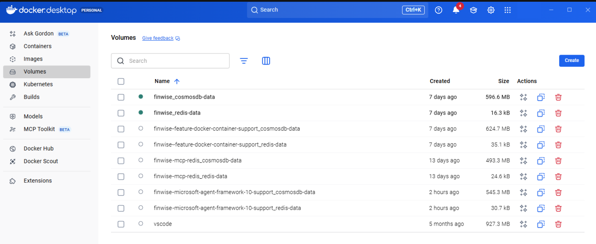
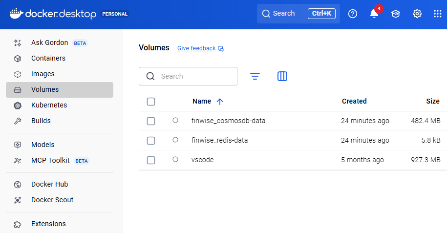

# 15 — The Phantom Data Loss in CosmosDB volumes after 'docker compose down'

*April 4, 2026*
*User profiles vanish after every `docker compose down` — but the data is still there on disk. The bug isn't in CosmosDB persistence, it's in Docker Compose project naming. Two compose files, two project names, two invisible volumes.*

---

## Where We Are

Journal 13 ended with FinWise fully Dockerized — three containers humming along, health checks green, data flowing through the CosmosDB emulator and Redis. Journal 14 was about upgrading to Microsoft Agent Framework 1.0 GA. Everything was running. The architecture was solid.

But something was wrong with the data.

User profiles — the financial context that the ProfileAgent carefully collects and stores in CosmosDB — kept disappearing. Create a profile, verify it's there, run `docker compose down`, bring everything back up with `docker compose up -d`, and... the profile is gone. Every time.

The CosmosDB emulator was configured correctly. `AZURE_COSMOS_EMULATOR_ENABLE_DATA_PERSISTENCE=true` was set. A Docker volume was mounted at `/tmp/cosmos/appdata`. The volume wasn't being deleted — `docker compose down` without `-v` preserves volumes. So where was the data going?

---

## Phase 1: The Obvious Suspects

The first instinct was to blame the CosmosDB emulator. It's a complex piece of software running inside a Linux container, emulating a distributed database with an ESE engine (the same one used by Active Directory). Surely the emulator was failing to flush data before shutdown?

### Reading the Entrypoint Script

A direct inspection of the emulator's `start.sh` script revealed the internal mechanics:

```sh
COSMOS_APP_HOME=/tmp/cosmos

if [ -z "${AZURE_COSMOS_EMULATOR_CERTIFICATE}${AZURE_COSMOS_EMULATOR_ENABLE_DATA_PERSISTENCE}" ]; then
    # No persistence — wipe everything
    rm -fr "${COSMOS_APP_HOME}/appdata"
    mkdir -p ${COSMOS_APP_HOME}/appdata
else
    # Persistence enabled — clean logs but preserve .system/
    rm -fr "${COSMOS_APP_HOME}/appdata/log"
    rm -fr "${COSMOS_APP_HOME}/appdata/var"
    rm -fr "${COSMOS_APP_HOME}/appdata/wfroot"
    rm -fr "${COSMOS_APP_HOME}/appdata/Packages"
fi
```

When `AZURE_COSMOS_EMULATOR_ENABLE_DATA_PERSISTENCE=true`, the script preserves the `.system/` directory — which contains `localemulator.db`, `edb.log`, and the transaction logs that hold all user data. It only cleans up ephemeral directories (logs, packages, runtime metadata). The volume mount at `/tmp/cosmos/appdata` was the exact right path. The mechanism was designed to work.

### Known Issues

A search of the [emulator's GitHub issues](https://github.com/Azure/azure-cosmos-db-emulator-docker/issues/96) turned up a known bug: _"AZURE_COSMOS_EMULATOR_ENABLE_DATA_PERSISTENCE flag is not respected."_ It had been open since May 2024. But the workaround described there — using a named volume and `docker stop`/`docker start` instead of `docker run` — was exactly what Docker Compose with named volumes already does.

The hypothesis was that `docker compose down` (which *removes* containers) might confuse the ESE engine, which can't replay transaction logs cleanly into a freshly created container. This was plausible — and wrong.

---

## Phase 2: The Manual Test That Didn't Fail

To verify, a systematic test was run. Write a profile via the CosmosDB REST API, bring the containers down, bring them back up, read the profile:

```
=== WRITING TEST PROFILE ===
[OK] Database created
[OK] Container created
[OK] Document written
[OK] Verified read: userId=persistence-test@finwise.com, risk=Moderate

=== STOPPING INFRASTRUCTURE ===
[+] Stopping 2/2
 ✔ Container finwise-cosmosdb-emulator  Stopped
 ✔ Container finwise-redis              Stopped

=== STARTING INFRASTRUCTURE ===
[OK] Emulator healthy after 20 seconds

=== READING TEST PROFILE (after restart) ===
[OK] PERSISTENCE VERIFIED!
  userId: persistence-test@finwise.com
  riskTolerance: Moderate
```

Data survived `docker compose stop` / `docker compose start`. No surprise.

Then the critical test — the one that was supposed to fail:

```
docker compose -f docker-compose.infra.yml down
docker compose -f docker-compose.infra.yml up -d
```

Read the profile — **still there**. And again with a full `docker compose down` / `docker compose up -d` — **still there**.

Wait. If the data persists in every test, why was it disappearing in real usage?

---

## Phase 3: The Aha Moment — Eight Volumes Where There Should Be Two

A look at Docker Desktop's Volumes panel told a different story than expected:



**Eight volumes.** Four separate CosmosDB volumes (`finwise_cosmosdb-data`, `finwise-feature-docker-container-support_cosmosdb-data`, `finwise-mcp-redis_cosmosdb-data`, `finwise-microsoft-agent-framework-10-support_cosmosdb-data`), each with hundreds of megabytes of data, plus their redis counterparts. Each one created by a different Docker Compose invocation, each with a different project name prefix. Only the two green-dot volumes (`finwise_*`) were actively in use — the rest were orphaned ghosts from previous branch names and compose configurations.

The smoking gun was in the project names:

```
INFRA:      docker compose -f docker-compose.infra.yml config → name: finwise
FULL STACK: docker compose config                              → name: finwise-microsoft-agent-framework-10-support
```

The [docker-compose.infra.yml](../docker-compose.infra.yml) declared `name: finwise`. But the [docker-compose.yml](../docker-compose.yml) used `include: docker-compose.infra.yml` — and the `include:` directive in Docker Compose **does not inherit the `name`** from the included file. Instead, it falls back to the directory name as the project prefix.

So every time the user switched between:
- `docker compose -f docker-compose.infra.yml up` (for local .NET dev — project: `finwise`)
- `docker compose up` (for full stack — project: `finwise-microsoft-agent-framework-10-support`)

...Docker Compose silently created a **brand new set of volumes** with the different prefix. The profiles written by one compose command were invisible to the other. The data was never lost — it was in a parallel volume, perfectly preserved, completely unreachable.

The older volumes from branch names (`finwise-feature-docker-container-support`, `finwise-mcp-redis`) showed this had been happening since the Docker work began — every git branch checkout that changed the directory name created yet another orphaned set of volumes.

---

## Phase 4: The Fix

One line in [docker-compose.yml](../docker-compose.yml):

```yaml
name: finwise
```

That's it. Both compose files now resolve to the same project name, the same volume prefix, the same data.

The fix was verified end-to-end: write data with infra-only compose, tear down containers, bring up with full-stack compose, read data — found.

---

## Phase 5: Cleanup and Versioning

With the root cause fixed, two additional improvements were made:

### Global App Version

A centralized version was added to [Directory.Build.props](../Directory.Build.props):

```xml
<FinWiseVersion>0.3.1</FinWiseVersion>
<Version>$(FinWiseVersion)</Version>
```

This stamps all assemblies with `0.3.1` and provides a single place to bump the version. The Docker image tag in `docker-compose.yml` was updated from the incorrect `3.1` to `0.3.1` to match.

### Persistence Integration Tests

Three new tests were added to [CosmosDbPersistenceIntegrationTests.cs](../tests/FinWise.CosmosDb.IntegrationTests/CosmosDbPersistenceIntegrationTests.cs):

- **`WriteProfile_ForPersistenceVerification`** — writes a profile to a fixed `PersistenceTestDb`
- **`ReadProfile_SurvivesEmulatorRestart`** — writes then reads from an independent client/store instance
- **`Profile_SurvivesIndependentStoreInstances`** — full E2E with two completely separate CosmosClient instances

All 13 integration tests pass (10 existing + 3 new).

### Volume Cleanup

The eight orphaned volumes (over 2 GB of wasted disk) were deleted, leaving a clean slate for the unified `finwise_cosmosdb-data` and `finwise_redis-data` volumes.

This is how it is now with the volumes:



---

## What We Learned

### About Docker Compose

- **`include:` does not inherit `name:`** — The included file's `name` property is ignored by the parent file. Always declare `name:` explicitly in *every* compose file that might be invoked directly.
- **The default project name is the directory name** — This means git branch checkouts, repository renames, or simply cloning to a different path silently creates new volumes with new prefixes. For development databases, this is a data loss trap.
- **`docker compose down` preserves volumes; `down -v` deletes them** — But volume preservation only helps if you're hitting the *same* volume on the next `up`.

### About Debugging Data Loss

- **"The data is gone" vs. "the data is somewhere else"** — These are different problems with very different investigations. When a named volume exists and has data, but the app can't find it, the issue isn't persistence — it's addressing.
- **Check the obvious infrastructure first** — Before diving into emulator internals, ESE engine behavior, and GitHub issues, a simple `docker volume ls` would have revealed the problem in seconds.
- **Multiple volumes with similar names is always suspicious** — In this case, the Docker Desktop Volumes panel was the single most useful diagnostic.

### About the Emulator

- **`AZURE_COSMOS_EMULATOR_ENABLE_DATA_PERSISTENCE=true` works** — Despite the open GitHub issue (#96), with the correct volume mount at `/tmp/cosmos/appdata` and proper use of `docker compose stop`/`start` or named volumes, data survives across container restarts and even container removal/recreation.
- **The volume mount path `/tmp/cosmos/appdata` is correct** — This matches the emulator's `start.sh` working directory exactly. Mounting at `/tmp` (broader) is unnecessary and potentially harmful.

---

## What's Next

FinWise now has:
- A single, stable Docker Compose project name for consistent volumes
- A centralized version (`0.3.1`) in `Directory.Build.props` stamped on all assemblies
- Persistence integration tests proving data survives across store instances
- A clean Docker volume slate

The upgrade to Microsoft Agent Framework 1.0 GA (Journal 14) continues in parallel.

---

*Written: April 4, 2026*
