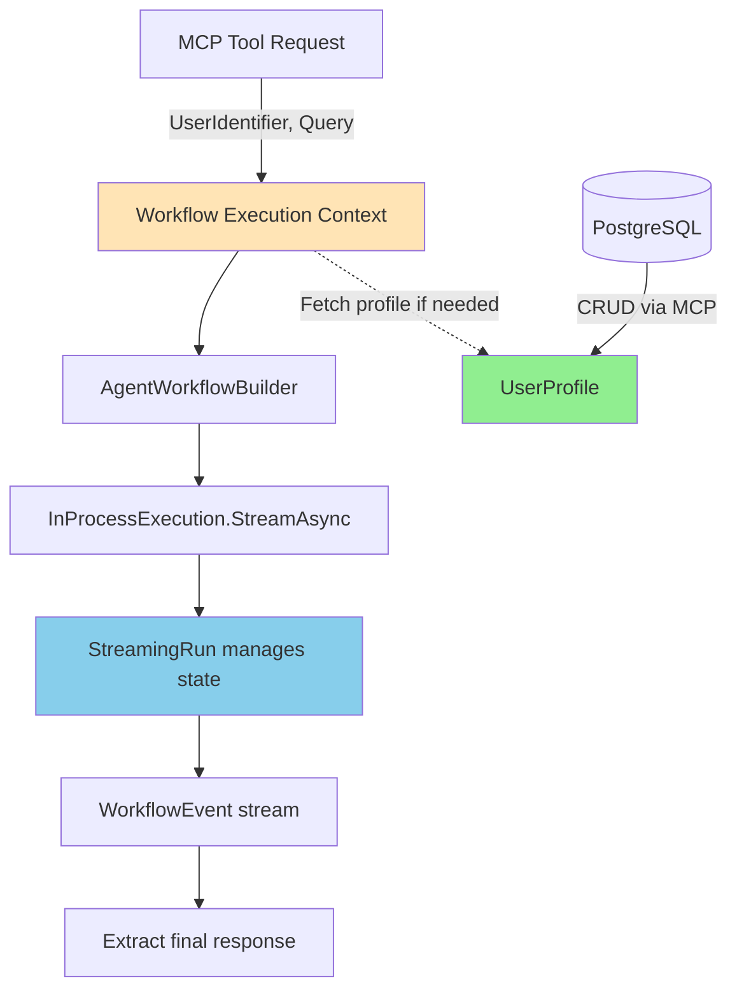

# Data Model: Core Multi-Agent Workflow

**Feature**: 001-core-workflow  
**Date**: December 30, 2025  
**Status**: Complete

## Overview

This document defines the data entities for the v0.1 multi-agent workflow system. The Microsoft Agent Framework handles workflow orchestration, agent handoffs, and conversation flow automatically through built-in types and APIs.

**Implementation Phases**:
- **Implementation Phase 1 (In-Memory POC)**: User profiles stored in `Dictionary<string, UserProfileDto>` within single process - no persistence, no database
- **Implementation Phase 2 (Persistent)**: User profiles stored in PostgreSQL via separate User Profile MCP Server process

**What the Framework Manages**:
- Agent transitions and handoffs (via `AgentWorkflowBuilder.WithHandoffs()`)
- Conversation state during workflow execution (via `StreamingRun`)
- Message passing between agents (via `ChatMessage` objects)
- Workflow events and monitoring (via `WorkflowEvent` stream)

**What We Need to Manage**:
- **Implementation Phase 1**: User profile data in-memory (Dictionary)
- **Implementation Phase 2**: User profile persistence (PostgreSQL via Entity Framework Core)
- **Both Phases**: MCP tool execution context (minimal, transient per-request)

---

## Entity Definitions

### 1. UserProfileDto (In-Memory - Implementation Phase 1 ONLY)

> **Implementation Phase 1 POC only** - This approach is replaced by persistent UserProfile entity in Implementation Phase 2. Temporary for quick testing.

**Purpose**: Temporary in-memory storage of user profile data for Implementation Phase 1 POC. Stored in `Dictionary<string, UserProfileDto>` within single FinWise.Orchestrator process. Profile data is lost when process restarts.

**C# Record**:
```csharp
public record UserProfileDto(
    string UserIdentifier,
    string RiskTolerance,        // "Conservative", "Moderate", "Aggressive"
    string InvestmentGoals,      // Free-form text, 1-500 chars
    string InvestmentTimeframe   // "ShortTerm", "MediumTerm", "LongTerm"
);
```

**Usage Pattern (Implementation Phase 1)**:
```csharp
// Static in-memory storage in Program.cs
var profileStorage = new Dictionary<string, UserProfileDto>();

// User Profile Agent directly updates Dictionary (no MCP client, no database)
profileStorage[userId] = new UserProfileDto(
    userId,
    "Moderate",
    "Retirement planning in 20 years",
    "LongTerm"
);

// Retrieve profile for Global Advisor Agent
if (profileStorage.TryGetValue(userId, out var profile))
{
    // Use profile data
}
```

**Limitations**:
- No persistence across process restarts
- No optimistic concurrency control
- No audit trail (CreatedAt, UpdatedAt)
- No JSONB questionnaire data
- Single process only - no multi-process architecture

**Migration to Implementation Phase 2**: Replace Dictionary operations with MCP client calls to User Profile MCP Server.

---

### 2. UserProfile (Persistent - PostgreSQL - Implementation Phase 2 ONLY)

> **Implementation Phase 2 implementation** - Requires PostgreSQL database and User Profile MCP Server (separate process). Not used in Implementation Phase 1.

**Purpose**: Stores user investment preferences and risk assessment data collected by the User Profile Agent.

**Fields**:
| Field | Type | Constraints | Description |
|-------|------|-------------|-------------|
| `Id` | UUID | Primary key, auto-generated | Unique profile identifier |
| `UserIdentifier` | String (255) | NOT NULL, UNIQUE | External user ID from AI assistant (e.g., Claude user ID) |
| `RiskTolerance` | Enum | NOT NULL, IN ('Conservative', 'Moderate', 'Aggressive') | User's investment risk tolerance level |
| `InvestmentGoals` | String | NOT NULL, 1-500 chars | User's investment objectives in free-form text |
| `InvestmentTimeframe` | Enum | NOT NULL, IN ('ShortTerm', 'MediumTerm', 'LongTerm') | Investment horizon (1-3 years, 3-10 years, 10+ years) |
| `QuestionnaireResponses` | JSONB | NULLABLE | Additional questionnaire data (flexible schema for future questions) |
| `CreatedAt` | DateTimeOffset | NOT NULL, DEFAULT NOW() | Profile creation timestamp |
| `UpdatedAt` | DateTimeOffset | NOT NULL, DEFAULT NOW() | Last modification timestamp |
| `Version` | Int | NOT NULL, DEFAULT 1 | Optimistic concurrency control version |

**Validation Rules**:
- `UserIdentifier` must match pattern: `^[a-zA-Z0-9_-]{3,255}$`
- `InvestmentGoals` must be 1-500 characters long, non-empty, and trimmed
  - Examples: "Save for retirement in 20 years", "Buy a home and build emergency fund"
- `InvestmentTimeframe` must align with `RiskTolerance`:
  - Conservative + ShortTerm = valid
  - Aggressive + ShortTerm = warning (high risk for short horizon)
- `QuestionnaireResponses` JSON schema validation (if provided)

**State Transitions**:
1. **Created**: User Profile Agent creates new profile after initial questionnaire (multi-turn conversation: asks 3 questions sequentially, 1 per turn)
2. **Updated**: User Profile Agent modifies existing profile (increments `Version`)
3. **Retrieved**: Orchestrator or Global Advisor Agent reads profile for context

**Questionnaire Collection Pattern**: The User Profile Agent uses a multi-turn conversation where it asks ONE data point question per turn (e.g., "What is your risk tolerance?") and waits for the user's response before proceeding to the next question. This ensures natural dialogue flow and allows the LLM to adapt follow-up questions based on previous answers.

**C# Entity Model**:
```csharp
public class UserProfile
{
    public Guid Id { get; set; }
    public string UserIdentifier { get; set; } = null!;
    public RiskTolerance RiskTolerance { get; set; }
    public string InvestmentGoals { get; set; } = string.Empty;
    public InvestmentTimeframe InvestmentTimeframe { get; set; }
    public JsonDocument? QuestionnaireResponses { get; set; }
    public DateTimeOffset CreatedAt { get; set; }
    public DateTimeOffset UpdatedAt { get; set; }
    public int Version { get; set; }
}

public enum RiskTolerance
{
    Conservative,
    Moderate,
    Aggressive
}

public enum InvestmentTimeframe
{
    ShortTerm,   // 1-3 years
    MediumTerm,  // 3-10 years
    LongTerm     // 10+ years
}
```

**Database Schema (PostgreSQL)**:
```sql
CREATE TABLE user_profiles (
    id UUID PRIMARY KEY DEFAULT gen_random_uuid(),
    user_identifier VARCHAR(255) NOT NULL UNIQUE,
    risk_tolerance VARCHAR(50) NOT NULL CHECK (risk_tolerance IN ('Conservative', 'Moderate', 'Aggressive')),
    investment_goals TEXT NOT NULL CHECK (LENGTH(investment_goals) BETWEEN 1 AND 500),
    investment_timeframe VARCHAR(50) NOT NULL CHECK (investment_timeframe IN ('ShortTerm', 'MediumTerm', 'LongTerm')),
    questionnaire_responses JSONB,
    created_at TIMESTAMP WITH TIME ZONE NOT NULL DEFAULT NOW(),
    updated_at TIMESTAMP WITH TIME ZONE NOT NULL DEFAULT NOW(),
    version INT NOT NULL DEFAULT 1
);

CREATE INDEX idx_user_profiles_user_identifier ON user_profiles(user_identifier);

-- Trigger to auto-update updated_at timestamp
CREATE OR REPLACE FUNCTION update_updated_at_column()
RETURNS TRIGGER AS $$
BEGIN
    NEW.updated_at = NOW();
    RETURN NEW;
END;
$$ LANGUAGE plpgsql;

CREATE TRIGGER update_user_profiles_updated_at
BEFORE UPDATE ON user_profiles
FOR EACH ROW
EXECUTE FUNCTION update_updated_at_column();
```

---

### 3. WorkflowExecutionContext (Transient - Both Phases)

**Purpose**: Minimal context passed to MCP tool during workflow execution. This is NOT a persistent entity - it exists only for the duration of a single MCP tool call. Used in both Implementation Phase 1 and Implementation Phase 2.

**C# Record**:
```csharp
public record WorkflowExecutionContext(
    string UserIdentifier,
    string Query,
    DateTimeOffset RequestTime
);
```

**Usage**: Created at the start of each MCP tool invocation (e.g., `get_investment_recommendations`), discarded after workflow completes.

---

## Framework-Managed Types (No Custom Implementation Needed)

The Microsoft Agent Framework provides built-in types for workflow execution. We use these framework types directly:

### ChatMessage (Framework Type)
**What it is**: Framework's message class for agent communication  
**How we use it**:
```csharp
List<ChatMessage> messages = [new(ChatRole.User, query)];
await using StreamingRun run = await InProcessExecution.StreamAsync(workflow, messages);
```
**Documentation**: [Microsoft Agent Framework - ChatMessage](https://learn.microsoft.com/en-us/agent-framework/user-guide/workflows/using-agents)

---

### AgentWorkflowBuilder (Framework API)
**What it is**: Framework's declarative handoff configuration  
**How we use it**:
```csharp
Workflow workflow = AgentWorkflowBuilder.CreateHandoffBuilderWith(orchestratorAgent)
    .WithHandoffs(orchestratorAgent, [profileAgent, advisorAgent])
    .WithHandoffs([profileAgent, advisorAgent], orchestratorAgent)
    .Build();
```
**Documentation**: [Microsoft Agent Framework - Handoff Orchestration](https://learn.microsoft.com/en-us/agent-framework/user-guide/workflows/orchestrations/handoff)

---

### StreamingRun (Framework Type)
**What it is**: Framework's workflow execution handle  
**How we use it**:
```csharp
await foreach (WorkflowEvent evt in run.WatchStreamAsync())
{
    if (evt is ExecutorInvokedEvent invoked)
        _logger.LogInformation("Agent activated: {AgentId}", invoked.ExecutorId);
    if (evt is WorkflowOutputEvent output)
        return output.Data; // Final response
}
```
**Documentation**: [Microsoft Agent Framework - Workflow Events](https://learn.microsoft.com/en-us/agent-framework/user-guide/workflows/core-concepts/events)

---

### WorkflowEvent (Framework Type)
**What it is**: Framework's event stream for observability  
**Key event types**:
- `ExecutorInvokedEvent`: Agent starts processing
- `ExecutorCompletedEvent`: Agent finishes task
- `WorkflowOutputEvent`: Final workflow result
- `WorkflowErrorEvent`: Error occurred

**How we use it**: Monitor workflow progress and extract final results  
**Documentation**: [Microsoft Agent Framework - Events](https://learn.microsoft.com/en-us/agent-framework/user-guide/workflows/core-concepts/events)

---

## Validation and Invariants

### UserProfile Validation Rules
| Field | Rule | Enforcement |
|-------|------|-------------|
| `UserIdentifier` | Pattern: `^[a-zA-Z0-9_-]{3,255}$` | Database constraint + EF Core validation |
| `InvestmentGoals` | Length: 1-500 chars | Database CHECK constraint |
| `RiskTolerance` | Enum values only | Database CHECK constraint |
| `InvestmentTimeframe` | Enum values only | Database CHECK constraint |
| `Version` | Optimistic concurrency | EF Core concurrency token |

### Risk/Timeframe Alignment
Application-level validation warns about mismatched combinations:
- Aggressive + ShortTerm = Warning (high risk for short horizon)
- Conservative + LongTerm = Optimal alignment

---

## Simplified Architecture

**v0.1 Data Model**: Only `UserProfile` entity persisted in PostgreSQL.



**Key Points**:
- UserProfile: Only persistent entity (green)
- Workflow Execution Context: Transient per request (tan)
- Framework manages workflow state (blue)

---

## Execution Flow

### MCP Tool Invocation → Workflow Execution

```
AI Assistant calls MCP tool: get_investment_recommendations(query, userId)
    ↓
[Create WorkflowExecutionContext(userId, query, timestamp)]
    ↓
Build workflow with AgentWorkflowBuilder (Orchestrator → Profile → Advisor)
    ↓
Execute: InProcessExecution.StreamAsync(workflow, [ChatMessage(User, query)])
    ↓
Framework routes through agents automatically based on handoff config
    ↓
Agents may call User Profile MCP Server to get/save UserProfile
    ↓
Watch WorkflowEvent stream for ExecutorInvokedEvent, WorkflowOutputEvent
    ↓
Extract final response from WorkflowOutputEvent
    ↓
Return response to AI Assistant via MCP
    ↓
[WorkflowExecutionContext disposed - no persistence]
```

**Key Insight**: Each MCP tool call is stateless. The framework manages workflow execution in-memory for that request only.

---

## Performance Considerations

### Database Access
- **User Profile Lookups**: <500ms (indexed on `user_identifier`)
- **Profile Updates**: Optimistic concurrency via `version` field
- **Connection Pooling**: User Profile MCP Server maintains connection pool

### Memory Management
- **Per-Request Context**: WorkflowExecutionContext discarded after MCP tool completes
- **Conversation History**: Not persisted in v0.1 (stateless MCP tool calls)
- **Framework State**: StreamingRun disposed after workflow completes

### Data Retention
- **PostgreSQL**: User profiles retained indefinitely
- **Workflow State**: No persistence (each MCP tool call is stateless)
- **Logging**: Structured logs retained for 30 days

---

## Migration Path (Future Versions)

### v0.3+: Persistent Conversation History
- Add new MCP Server for conversation persistence in Azure Cosmos DB (NoSQL)
- Store conversation sessions with embeddings, vectors, and RAG data
- Persist `ChatMessage` objects from framework to NoSQL database
- Link sessions to UserProfile via `user_identifier`
- Enable semantic search and context retrieval across conversation history

> **Note**: Persistent conversation/session history will require a new additional MCP Server for session/conversation persistence in a NoSQL database (likely Azure Cosmos DB). This server will store embeddings, vectors, RAG data, and conversation history for advanced context retrieval and semantic search capabilities.

### v0.4+: Advanced Handoff Tracking
- Optional: Store handoff analytics (frequency, reasons, latency)
- Use framework's `WorkflowEvent` stream for telemetry collection

---

## Summary

**Simplified v0.1 Data Model**:
- **One persistent entity**: `UserProfile` (PostgreSQL)
- **One transient record**: `WorkflowExecutionContext` (per MCP request)
- **Framework-managed**: All workflow orchestration, agent handoffs, conversation flow

**How Requirements Are Met**:
- **FR-003**: Agent handoffs → Framework's `AgentWorkflowBuilder.WithHandoffs()`
- **FR-004**: Conversation history → Framework's `ChatMessage` accumulation during workflow
- **FR-008/009**: User profile data → `UserProfile` entity in PostgreSQL
- **FR-015**: Dynamic navigation → Framework's workflow routing
- **FR-016**: Agent escalation → Framework's handoff patterns
- **FR-018**: Circular detection → Framework prevents invalid handoffs at build time
- **FR-019**: Conversation state → Framework's `StreamingRun` manages execution state

**Key Simplification**: Microsoft Agent Framework handles 90% of data management. We only persist user profiles - everything else is framework-managed or transient.
