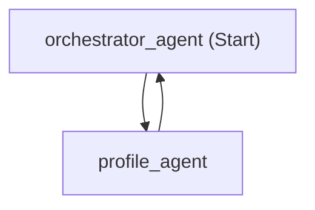
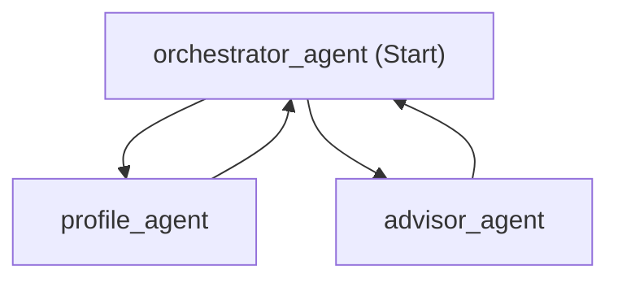
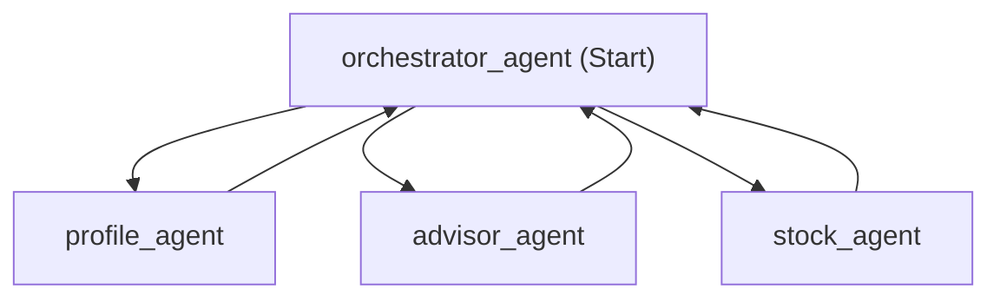
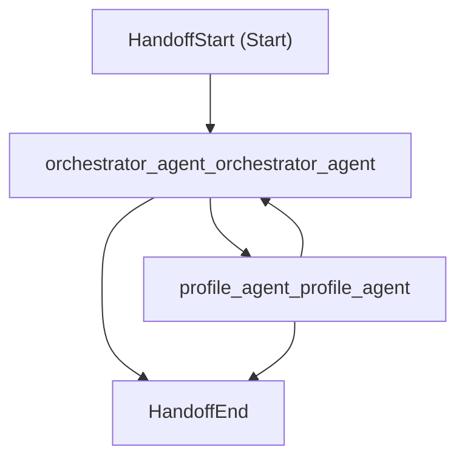
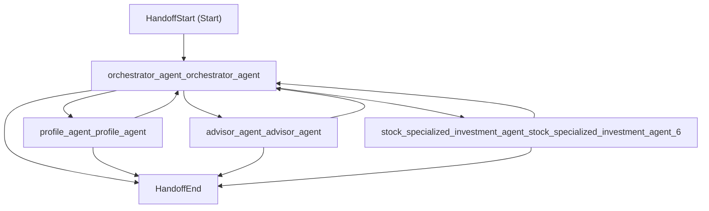

# FinWise Workflow Visualization

FinWise uses a **hub-and-spoke** architecture where all specialist agents route exclusively through the Orchestrator. No direct agent-to-agent calls are allowed. The workflow configuration changes dynamically based on whether the user's profile has been collected and whether the stock agent is configured.

## Workflow States

### Pre-Profile (2 agents)

Before the user completes their profile, only the profile agent is available. The orchestrator can only hand off to the profile agent and vice versa.



### Post-Profile without Stock Agent (3 agents)

Once the profile is complete (`PROFILE_READY`), the advisor agent becomes available for investment recommendations.



### Full Workflow with Stock Agent (4 agents)

When Azure AI Foundry is configured, the stock agent is included for market analysis.



### Live Workflow generated from the log execution - Pre-Profile (2 agents)


### Live Workflow generated from the log execution - Full workflow (4 agents)




## Runtime Visualization via Logging

The `CreateAgentsAndWorkflow` method logs the Mermaid diagram at `Debug` level after each workflow build:

```csharp
Log.Debug("Workflow Mermaid visualization:\n{MermaidDiagram}", workflow.ToMermaidString());
```

When you run the MCP server with Debug logging enabled, the output will show the exact workflow graph for the current session state:

```
Workflow Mermaid visualization:
flowchart TD
  orchestrator_agent["orchestrator_agent (Start)"];
  profile_agent["profile_agent"];
  orchestrator_agent --> profile_agent;
  profile_agent --> orchestrator_agent;
```

To capture this, ensure your Serilog minimum level includes `Debug` in `appsettings.Development.json`.

## Viewing the Diagrams

### From Runtime Logs

Copy the `flowchart TD ...` block from the log output and use any of the methods below.

### Interactive Viewers

| Method | Steps |
|--------|-------|
| **[mermaid.live](https://mermaid.live)** (fastest) | Paste the Mermaid block → instant rendering → click **Export PNG** to download |
| **VS Code preview** | Install the [Markdown Mermaid](https://marketplace.visualstudio.com/items?itemName=bierner.markdown-mermaid) extension → open this README in Markdown preview |
| **GitHub** | Push this file → GitHub renders ` ```mermaid ` blocks natively in Markdown |

### PNG Export

| Tool | Command |
|------|---------|
| **mermaid.live** | Paste → click "Export PNG" button in the UI |
| **Mermaid CLI** | `npm install -g @mermaid-js/mermaid-cli` then `mmdc -i full-workflow.mmd -o workflow.png` |
| **GraphViz** (via `ToDotString()`) | Install [GraphViz](https://graphviz.org/download/), then pipe DOT output: `dot -Tpng -o workflow.png` |

### Standalone `.mmd` Files

The `.mmd` files in this folder can be used directly with any of the methods above — paste their contents into mermaid.live, or use `mmdc` from the command line.

## GraphViz Output

The `WorkflowVisualizer` also provides `ToDotString()` for GraphViz DOT format output, which can be rendered with the `dot` CLI tool or online at [GraphViz Online](https://dreampuf.github.io/GraphvizOnline/).
