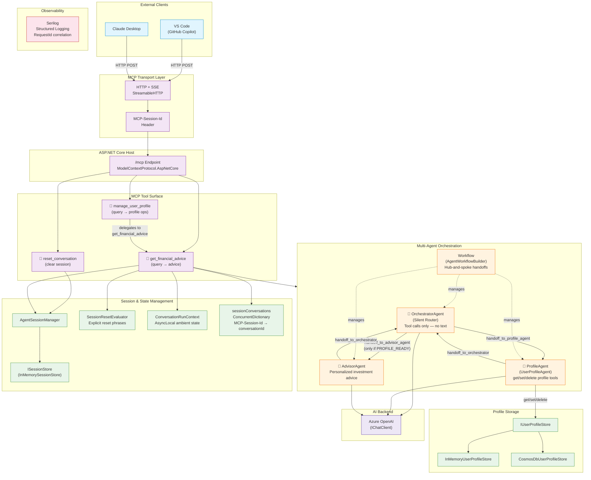
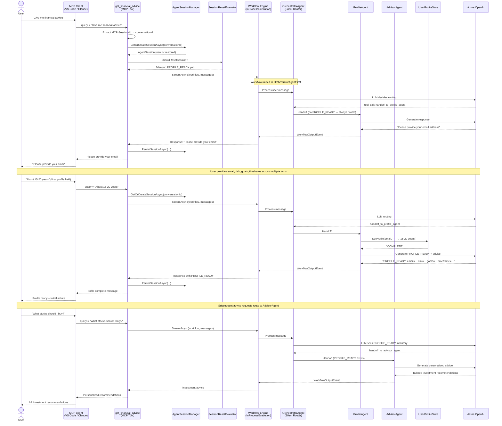
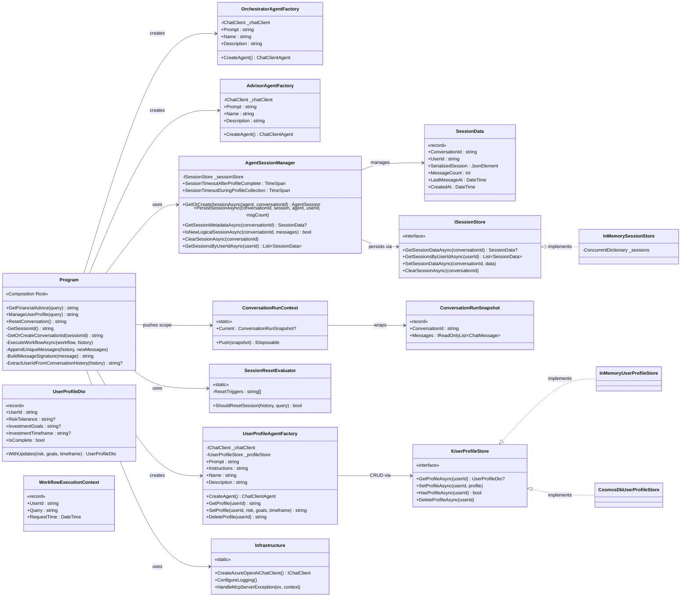

# FinWise — Architecture & Design Diagrams (v0.1)

## System Architecture Overview

```mermaid
graph TB
    subgraph External["External Clients"]
        VSCode["VS Code<br/>(GitHub Copilot)"]
        Claude["Claude Desktop"]
    end

    subgraph MCP_Transport["MCP Transport Layer"]
        HTTP["HTTP + SSE<br/>StreamableHTTP"]
        SessionHeader["MCP-Session-Id<br/>Header"]
    end

    subgraph ASP_NET["ASP.NET Core Host"]
        McpEndpoint["/mcp Endpoint<br/>ModelContextProtocol.AspNetCore"]
    end

    subgraph MCP_Tools["MCP Tool Surface"]
        T1["🔧 get_financial_advice<br/>(query → advice)"]
        T2["🔧 manage_user_profile<br/>(query → profile ops)"]
        T3["🔧 reset_conversation<br/>(clear session)"]
    end

    subgraph Orchestration["Multi-Agent Orchestration"]
        direction TB
        Orch["🤖 OrchestratorAgent<br/>(Silent Router)<br/>Tool calls only — no text"]
        Profile["🤖 ProfileAgent<br/>(UserProfileAgent)<br/>get/set/delete profile tools"]
        Advisor["🤖 AdvisorAgent<br/>Personalized investment advice"]
        Workflow["Workflow<br/>(AgentWorkflowBuilder)<br/>Hub-and-spoke handoffs"]
    end

    subgraph Session_Mgmt["Session & State Management"]
        SM["AgentSessionManager"]
        SS["ISessionStore<br/>(InMemorySessionStore)"]
        SRE["SessionResetEvaluator<br/>Explicit reset phrases"]
        CRC["ConversationRunContext<br/>AsyncLocal ambient state"]
        SC["sessionConversations<br/>ConcurrentDictionary<br/>MCP-Session-Id → conversationId"]
    end

    subgraph Profile_Store["Profile Storage"]
        IPS["IUserProfileStore"]
        InMem["InMemoryUserProfileStore"]
        Cosmos["CosmosDbUserProfileStore"]
    end

    subgraph AI_Backend["AI Backend"]
        AzureOAI["Azure OpenAI<br/>(IChatClient)"]
    end

    subgraph Logging["Observability"]
        Serilog["Serilog<br/>Structured Logging<br/>RequestId correlation"]
    end

    VSCode -->|"HTTP POST"| HTTP
    Claude -->|"HTTP POST"| HTTP
    HTTP --> SessionHeader
    SessionHeader --> McpEndpoint

    McpEndpoint --> T1
    McpEndpoint --> T2
    McpEndpoint --> T3

    T1 --> Orchestration
    T2 -->|"delegates to<br/>get_financial_advice"| T1
    T3 --> SM

    Orch -->|"handoff_to_profile_agent"| Profile
    Orch -->|"handoff_to_advisor_agent<br/>(only if PROFILE_READY)"| Advisor
    Profile -->|"handoff_to_orchestrator"| Orch
    Advisor -->|"handoff_to_orchestrator"| Orch
    Workflow -.->|manages| Orch
    Workflow -.->|manages| Profile
    Workflow -.->|manages| Advisor

    Profile -->|"get/set/delete"| IPS
    IPS --> InMem
    IPS --> Cosmos

    Orch --> AzureOAI
    Profile --> AzureOAI
    Advisor --> AzureOAI

    SM --> SS
    T1 --> SM
    T1 --> SRE
    T1 --> CRC
    T1 --> SC

    classDef external fill:#e1f5fe,stroke:#0288d1
    classDef mcp fill:#f3e5f5,stroke:#7b1fa2
    classDef agent fill:#fff3e0,stroke:#ef6c00
    classDef storage fill:#e8f5e9,stroke:#388e3c
    classDef infra fill:#fce4ec,stroke:#c62828
    classDef ai fill:#ede7f6,stroke:#512da8

    class VSCode,Claude external
    class McpEndpoint,T1,T2,T3,HTTP,SessionHeader mcp
    class Orch,Profile,Advisor,Workflow agent
    class SM,SS,SRE,CRC,SC,IPS,InMem,Cosmos storage
    class Serilog infra
    class AzureOAI ai
```

## Request Lifecycle & Agent Handoff Sequence

```mermaid
sequenceDiagram
    actor User
    participant MCP as MCP Client<br/>(VS Code / Claude)
    participant Tool as get_financial_advice<br/>(MCP Tool)
    participant SM as AgentSessionManager
    participant SRE as SessionResetEvaluator
    participant WF as Workflow Engine<br/>(InProcessExecution)
    participant Orch as OrchestratorAgent<br/>(Silent Router)
    participant Prof as ProfileAgent
    participant Adv as AdvisorAgent
    participant Store as IUserProfileStore
    participant AI as Azure OpenAI

    User->>MCP: "Give me financial advice"
    MCP->>Tool: query = "Give me financial advice"

    Tool->>Tool: Extract MCP-Session-Id → conversationId
    Tool->>SM: GetOrCreateSessionAsync(conversationId)
    SM-->>Tool: AgentSession (new or restored)

    Tool->>SRE: ShouldResetSession?
    SRE-->>Tool: false (no PROFILE_READY yet)

    Tool->>WF: StreamAsync(workflow, messages)

    Note over WF,Orch: Workflow routes to OrchestratorAgent first

    WF->>Orch: Process user message
    Orch->>AI: LLM decides routing
    AI-->>Orch: tool_call: handoff_to_profile_agent
    Orch->>Prof: Handoff (no PROFILE_READY → always profile)

    Prof->>AI: Generate response
    AI-->>Prof: "Please provide your email address"
    Prof-->>WF: WorkflowOutputEvent

    WF-->>Tool: Response: "Please provide your email"
    Tool->>SM: PersistSessionAsync(...)
    Tool-->>MCP: "Please provide your email"
    MCP-->>User: "Please provide your email"

    Note over User,AI: ... User provides email, risk, goals, timeframe across multiple turns ...

    User->>MCP: "About 15-20 years" (final profile field)
    MCP->>Tool: query = "About 15-20 years"
    Tool->>SM: GetOrCreateSessionAsync(conversationId)
    Tool->>WF: StreamAsync(workflow, messages)

    WF->>Orch: Process message
    Orch->>AI: LLM routing
    AI-->>Orch: handoff_to_profile_agent
    Orch->>Prof: Handoff

    Prof->>Store: SetProfile(email, "", "", "15-20 years")
    Store-->>Prof: "COMPLETE"
    Prof->>AI: Generate PROFILE_READY + advice
    AI-->>Prof: "PROFILE_READY: email=... risk=... goals=... timeframe=..."
    Prof-->>WF: WorkflowOutputEvent

    WF-->>Tool: Response with PROFILE_READY
    Tool->>SM: PersistSessionAsync(...)
    Tool-->>MCP: Profile complete message
    MCP-->>User: Profile ready + initial advice

    Note over User,AI: Subsequent advice requests route to AdvisorAgent

    User->>MCP: "What stocks should I buy?"
    MCP->>Tool: query = "What stocks should I buy?"
    Tool->>WF: StreamAsync(workflow, messages)

    WF->>Orch: Process message
    Orch->>AI: LLM sees PROFILE_READY in history
    AI-->>Orch: handoff_to_advisor_agent
    Orch->>Adv: Handoff (PROFILE_READY exists)

    Adv->>AI: Generate personalized advice
    AI-->>Adv: Tailored investment recommendations
    Adv-->>WF: WorkflowOutputEvent

    WF-->>Tool: Investment advice
    Tool-->>MCP: Personalized recommendations
    MCP-->>User: 📊 Investment recommendations
```

## Class & Component Diagram

```mermaid
classDiagram
    direction LR

    class Program {
        «Composition Root»
        +GetFinancialAdvice(query) string
        +ManageUserProfile(query) string
        +ResetConversation() string
        -GetSessionId() string
        -GetOrCreateConversationId(sessionId) string
        -ExecuteWorkflowAsync(workflow, history)
        -AppendUniqueMessages(history, newMessages)
        -BuildMessageSignature(message) string
        -ExtractUserIdFromConversationHistory(history) string?
    }

    class OrchestratorAgentFactory {
        -IChatClient _chatClient
        +Prompt : string
        +Name : string
        +Description : string
        +CreateAgent() ChatClientAgent
    }

    class AdvisorAgentFactory {
        -IChatClient _chatClient
        +Prompt : string
        +Name : string
        +Description : string
        +CreateAgent() ChatClientAgent
    }

    class UserProfileAgentFactory {
        -IChatClient _chatClient
        -IUserProfileStore _profileStore
        +Prompt : string
        +Instructions : string
        +Name : string
        +Description : string
        +CreateAgent() ChatClientAgent
        +GetProfile(userId) string
        +SetProfile(userId, risk, goals, timeframe) string
        +DeleteProfile(userId) string
    }

    class AgentSessionManager {
        -ISessionStore _sessionStore
        +SessionTimeoutAfterProfileComplete : TimeSpan
        +SessionTimeoutDuringProfileCollection : TimeSpan
        +GetOrCreateSessionAsync(agent, conversationId) AgentSession
        +PersistSessionAsync(conversationId, session, agent, userId, msgCount)
        +GetSessionMetadataAsync(conversationId) SessionData?
        +IsNewLogicalSessionAsync(conversationId, messages) bool
        +ClearSessionAsync(conversationId)
        +GetSessionsByUserIdAsync(userId) List~SessionData~
    }

    class SessionData {
        «record»
        +ConversationId : string
        +UserId : string
        +SerializedSession : JsonElement
        +MessageCount : int
        +LastMessageAt : DateTime
        +CreatedAt : DateTime
    }

    class ISessionStore {
        «interface»
        +GetSessionDataAsync(conversationId) SessionData?
        +GetSessionsByUserIdAsync(userId) List~SessionData~
        +SetSessionDataAsync(conversationId, data)
        +ClearSessionAsync(conversationId)
    }

    class InMemorySessionStore {
        -ConcurrentDictionary _sessions
    }

    class SessionResetEvaluator {
        «static»
        -ResetTriggers : string[]
        +ShouldResetSession(history, query) bool
    }

    class ConversationRunContext {
        «static»
        +Current : ConversationRunSnapshot?
        +Push(snapshot) IDisposable
    }

    class ConversationRunSnapshot {
        «record»
        +ConversationId : string
        +Messages : IReadOnlyList~ChatMessage~
    }

    class UserProfileDto {
        «record»
        +UserId : string
        +RiskTolerance : string?
        +InvestmentGoals : string?
        +InvestmentTimeframe : string?
        +IsComplete : bool
        +WithUpdates(risk, goals, timeframe) UserProfileDto
    }

    class WorkflowExecutionContext {
        «record»
        +UserId : string
        +Query : string
        +RequestTime : DateTime
    }

    class IUserProfileStore {
        «interface»
        +GetProfileAsync(userId) UserProfileDto?
        +SetProfileAsync(userId, profile)
        +HasProfileAsync(userId) bool
        +DeleteProfileAsync(userId)
    }

    class InMemoryUserProfileStore
    class CosmosDbUserProfileStore

    class Infrastructure {
        «static»
        +CreateAzureOpenAIChatClient() IChatClient
        +ConfigureLogging()
        +HandleMcpServerException(ex, context)
    }

    Program --> AgentSessionManager : uses
    Program --> SessionResetEvaluator : uses
    Program --> ConversationRunContext : pushes scope
    Program --> OrchestratorAgentFactory : creates
    Program --> AdvisorAgentFactory : creates
    Program --> UserProfileAgentFactory : creates
    Program --> Infrastructure : uses

    AgentSessionManager --> ISessionStore : persists via
    ISessionStore <|.. InMemorySessionStore : implements

    UserProfileAgentFactory --> IUserProfileStore : CRUD via
    IUserProfileStore <|.. InMemoryUserProfileStore : implements
    IUserProfileStore <|.. CosmosDbUserProfileStore : implements

    ConversationRunContext --> ConversationRunSnapshot : wraps

    AgentSessionManager --> SessionData : manages
```
