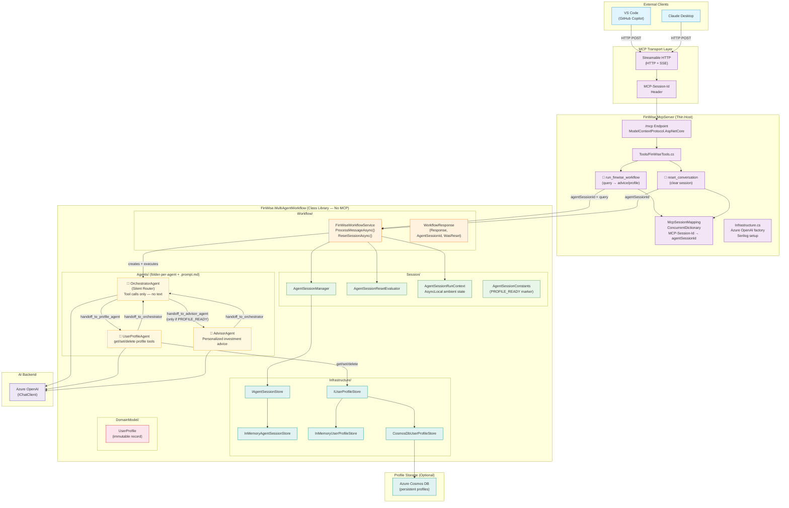
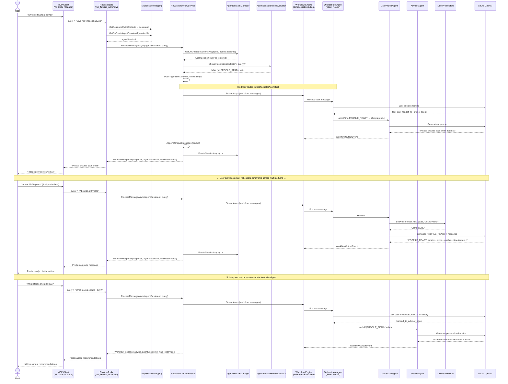
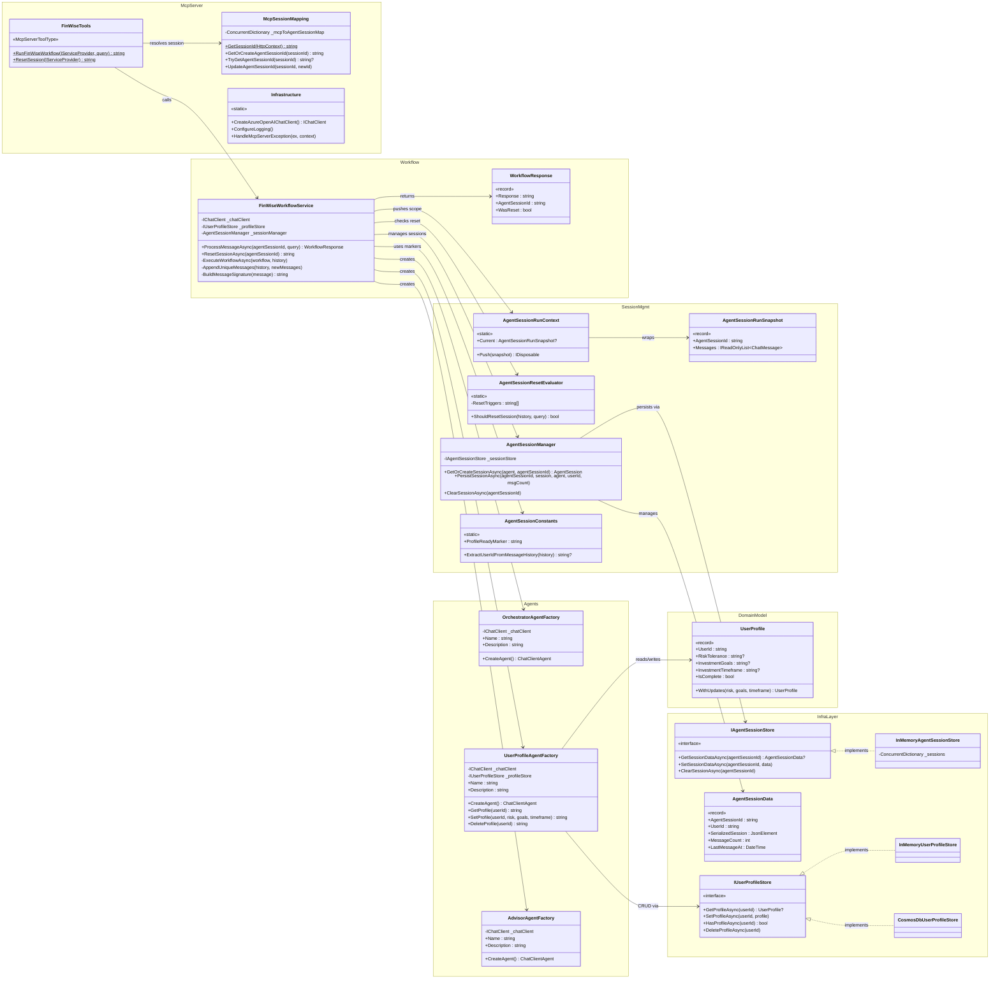

# FinWise — Architecture & Design Diagrams (v0.2)

## System Architecture Overview

```mermaid
graph TB
    subgraph External["External Clients"]
        VSCode["VS Code<br/>(GitHub Copilot)"]
        Claude["Claude Desktop"]
    end

    subgraph MCP_Transport["MCP Transport Layer"]
        HTTP["Streamable HTTP<br/>(HTTP + SSE)"]
        SessionHeader["MCP-Session-Id<br/>Header"]
    end

    subgraph McpServer["FinWise.McpServer (Thin Host)"]
        McpEndpoint["/mcp Endpoint<br/>ModelContextProtocol.AspNetCore"]
        Tools["Tools/FinWiseTools.cs"]
        T1["🔧 run_finwise_workflow<br/>(query → advice/profile)"]
        T2["🔧 reset_conversation<br/>(clear session)"]
        SessionMap["McpSessionMapping<br/>ConcurrentDictionary<br/>MCP-Session-Id → agentSessionId"]
        Infra["Infrastructure.cs<br/>Azure OpenAI factory<br/>Serilog setup"]
    end

    subgraph WorkflowLib["FinWise.MultiAgentWorkflow (Class Library — No MCP)"]
        direction TB

        subgraph Orchestration["Workflow/"]
            WFS["FinWiseWorkflowService<br/>ProcessMessageAsync()<br/>ResetSessionAsync()"]
            WR["WorkflowResponse<br/>(Response, AgentSessionId, WasReset)"]
        end

        subgraph Agents["Agents/ (folder-per-agent + .prompt.md)"]
            Orch["🤖 OrchestratorAgent<br/>(Silent Router)<br/>Tool calls only — no text"]
            Profile["🤖 UserProfileAgent<br/>get/set/delete profile tools"]
            Advisor["🤖 AdvisorAgent<br/>Personalized investment advice"]
        end

        subgraph Session_Mgmt["Session/"]
            SM["AgentSessionManager"]
            SRE["AgentSessionResetEvaluator"]
            CRC["AgentSessionRunContext<br/>AsyncLocal ambient state"]
            SC["AgentSessionConstants<br/>(PROFILE_READY marker)"]
        end

        subgraph Infra_Lib["Infrastructure/"]
            ISS["IAgentSessionStore"]
            IMSS["InMemoryAgentSessionStore"]
            IPS["IUserProfileStore"]
            InMem["InMemoryUserProfileStore"]
            Cosmos["CosmosDbUserProfileStore"]
        end

        subgraph Domain["DomainModel/"]
            UP["UserProfile<br/>(immutable record)"]
        end
    end

    subgraph AI_Backend["AI Backend"]
        AzureOAI["Azure OpenAI<br/>(IChatClient)"]
    end

    subgraph Profile_Store["Profile Storage (Optional)"]
        CosmosDB["Azure Cosmos DB<br/>(persistent profiles)"]
    end

    VSCode -->|"HTTP POST"| HTTP
    Claude -->|"HTTP POST"| HTTP
    HTTP --> SessionHeader
    SessionHeader --> McpEndpoint

    McpEndpoint --> Tools
    Tools --> T1
    Tools --> T2

    T1 --> SessionMap
    T2 --> SessionMap
    T1 -->|"agentSessionId + query"| WFS
    T2 -->|"agentSessionId"| WFS

    WFS --> SM
    WFS --> SRE
    WFS --> CRC

    WFS -->|"creates + executes"| Orch
    Orch -->|"handoff_to_profile_agent"| Profile
    Orch -->|"handoff_to_advisor_agent<br/>(only if PROFILE_READY)"| Advisor
    Profile -->|"handoff_to_orchestrator"| Orch
    Advisor -->|"handoff_to_orchestrator"| Orch

    Profile -->|"get/set/delete"| IPS
    IPS --> InMem
    IPS --> Cosmos
    Cosmos --> CosmosDB

    SM --> ISS
    ISS --> IMSS
    Orch --> AzureOAI
    Profile --> AzureOAI
    Advisor --> AzureOAI

    classDef external fill:#e1f5fe,stroke:#0288d1
    classDef mcp fill:#f3e5f5,stroke:#7b1fa2
    classDef workflow fill:#fff3e0,stroke:#ef6c00
    classDef agent fill:#fff8e1,stroke:#f9a825
    classDef session fill:#e8f5e9,stroke:#388e3c
    classDef storage fill:#e0f2f1,stroke:#00897b
    classDef ai fill:#ede7f6,stroke:#512da8
    classDef domain fill:#fce4ec,stroke:#c62828

    class VSCode,Claude external
    class McpEndpoint,Tools,T1,T2,HTTP,SessionHeader,SessionMap,Infra mcp
    class WFS,WR workflow
    class Orch,Profile,Advisor agent
    class SM,SRE,CRC,SC session
    class ISS,IMSS,IPS,InMem,Cosmos,CosmosDB storage
    class AzureOAI ai
    class UP domain
```

## Request Lifecycle & Agent Handoff Sequence

```mermaid
sequenceDiagram
    actor User
    participant MCP as MCP Client<br/>(VS Code / Claude)
    participant Tools as FinWiseTools<br/>(run_finwise_workflow)
    participant Map as McpSessionMapping
    participant WFS as FinWiseWorkflowService
    participant SM as AgentSessionManager
    participant SRE as AgentSessionResetEvaluator
    participant WF as Workflow Engine<br/>(InProcessExecution)
    participant Orch as OrchestratorAgent<br/>(Silent Router)
    participant Prof as UserProfileAgent
    participant Adv as AdvisorAgent
    participant Store as IUserProfileStore
    participant AI as Azure OpenAI

    User->>MCP: "Give me financial advice"
    MCP->>Tools: query = "Give me financial advice"

    Tools->>Map: GetSessionId(httpContext) → sessionId
    Tools->>Map: GetOrCreateAgentSessionId(sessionId)
    Map-->>Tools: agentSessionId

    Tools->>WFS: ProcessMessageAsync(agentSessionId, query)

    WFS->>SM: GetOrCreateSessionAsync(agent, agentSessionId)
    SM-->>WFS: AgentSession (new or restored)

    WFS->>SRE: ShouldResetSession(history, query)?
    SRE-->>WFS: false (no PROFILE_READY yet)

    WFS->>WFS: Push AgentSessionRunContext scope

    Note over WFS,Orch: Workflow routes to OrchestratorAgent first

    WFS->>WF: StreamAsync(workflow, messages)
    WF->>Orch: Process user message
    Orch->>AI: LLM decides routing
    AI-->>Orch: tool_call: handoff_to_profile_agent
    Orch->>Prof: Handoff (no PROFILE_READY → always profile)

    Prof->>AI: Generate response
    AI-->>Prof: "Please provide your email address"
    Prof-->>WF: WorkflowOutputEvent

    WFS->>WFS: AppendUniqueMessages (dedup)
    WFS->>SM: PersistSessionAsync(...)

    WFS-->>Tools: WorkflowResponse(response, agentSessionId, wasReset=false)
    Tools-->>MCP: "Please provide your email"
    MCP-->>User: "Please provide your email"

    Note over User,AI: ... User provides email, risk, goals, timeframe across multiple turns ...

    User->>MCP: "About 15-20 years" (final profile field)
    MCP->>Tools: query = "About 15-20 years"
    Tools->>WFS: ProcessMessageAsync(agentSessionId, query)

    WFS->>WF: StreamAsync(workflow, messages)
    WF->>Orch: Process message
    Orch->>Prof: Handoff

    Prof->>Store: SetProfile(email, risk, goals, "15-20 years")
    Store-->>Prof: "COMPLETE"
    Prof->>AI: Generate PROFILE_READY + response
    AI-->>Prof: "PROFILE_READY: email=... risk=... goals=... timeframe=..."
    Prof-->>WF: WorkflowOutputEvent

    WFS->>SM: PersistSessionAsync(...)
    WFS-->>Tools: WorkflowResponse(response, agentSessionId, wasReset=false)
    Tools-->>MCP: Profile complete message
    MCP-->>User: Profile ready + initial advice

    Note over User,AI: Subsequent advice requests route to AdvisorAgent

    User->>MCP: "What stocks should I buy?"
    MCP->>Tools: query = "What stocks should I buy?"
    Tools->>WFS: ProcessMessageAsync(agentSessionId, query)

    WFS->>WF: StreamAsync(workflow, messages)
    WF->>Orch: Process message
    Orch->>AI: LLM sees PROFILE_READY in history
    AI-->>Orch: handoff_to_advisor_agent
    Orch->>Adv: Handoff (PROFILE_READY exists)

    Adv->>AI: Generate personalized advice
    AI-->>Adv: Tailored investment recommendations
    Adv-->>WF: WorkflowOutputEvent

    WFS-->>Tools: WorkflowResponse(advice, agentSessionId, wasReset=false)
    Tools-->>MCP: Personalized recommendations
    MCP-->>User: 📊 Investment recommendations
```

## Class & Component Diagram

```mermaid
classDiagram
    direction LR

    namespace McpServer {
        class FinWiseTools {
            «McpServerToolType»
            +RunFinWiseWorkflow(IServiceProvider, query) string$
            +ResetSession(IServiceProvider) string$
        }

        class McpSessionMapping {
            -ConcurrentDictionary _mcpToAgentSessionMap
            +GetSessionId(HttpContext) string$
            +GetOrCreateAgentSessionId(sessionId) string
            +TryGetAgentSessionId(sessionId) string?
            +UpdateAgentSessionId(sessionId, newId)
        }

        class Infrastructure {
            «static»
            +CreateAzureOpenAIChatClient() IChatClient
            +ConfigureLogging()
            +HandleMcpServerException(ex, context)
        }
    }

    namespace Workflow {
        class FinWiseWorkflowService {
            -IChatClient _chatClient
            -IUserProfileStore _profileStore
            -AgentSessionManager _sessionManager
            +ProcessMessageAsync(agentSessionId, query) WorkflowResponse
            +ResetSessionAsync(agentSessionId) string
            -ExecuteWorkflowAsync(workflow, history)
            -AppendUniqueMessages(history, newMessages)
            -BuildMessageSignature(message) string
        }

        class WorkflowResponse {
            «record»
            +Response : string
            +AgentSessionId : string
            +WasReset : bool
        }
    }

    namespace Agents {
        class OrchestratorAgentFactory {
            -IChatClient _chatClient
            +Name : string
            +Description : string
            +CreateAgent() ChatClientAgent
        }

        class UserProfileAgentFactory {
            -IChatClient _chatClient
            -IUserProfileStore _profileStore
            +Name : string
            +Description : string
            +CreateAgent() ChatClientAgent
            +GetProfile(userId) string
            +SetProfile(userId, risk, goals, timeframe) string
            +DeleteProfile(userId) string
        }

        class AdvisorAgentFactory {
            -IChatClient _chatClient
            +Name : string
            +Description : string
            +CreateAgent() ChatClientAgent
        }
    }

    namespace SessionMgmt {
        class AgentSessionManager {
            -IAgentSessionStore _sessionStore
            +GetOrCreateSessionAsync(agent, agentSessionId) AgentSession
            +PersistSessionAsync(agentSessionId, session, agent, userId, msgCount)
            +ClearSessionAsync(agentSessionId)
        }

        class AgentSessionResetEvaluator {
            «static»
            -ResetTriggers : string[]
            +ShouldResetSession(history, query) bool
        }

        class AgentSessionRunContext {
            «static»
            +Current : AgentSessionRunSnapshot?
            +Push(snapshot) IDisposable
        }

        class AgentSessionRunSnapshot {
            «record»
            +AgentSessionId : string
            +Messages : IReadOnlyList~ChatMessage~
        }

        class AgentSessionConstants {
            «static»
            +ProfileReadyMarker : string
            +ExtractUserIdFromMessageHistory(history) string?
        }
    }

    namespace DomainModel {
        class UserProfile {
            «record»
            +UserId : string
            +RiskTolerance : string?
            +InvestmentGoals : string?
            +InvestmentTimeframe : string?
            +IsComplete : bool
            +WithUpdates(risk, goals, timeframe) UserProfile
        }
    }

    namespace InfraLayer {
        class IAgentSessionStore {
            «interface»
            +GetSessionDataAsync(agentSessionId) AgentSessionData?
            +SetSessionDataAsync(agentSessionId, data)
            +ClearSessionAsync(agentSessionId)
        }

        class AgentSessionData {
            «record»
            +AgentSessionId : string
            +UserId : string
            +SerializedSession : JsonElement
            +MessageCount : int
            +LastMessageAt : DateTime
        }

        class InMemoryAgentSessionStore {
            -ConcurrentDictionary _sessions
        }

        class IUserProfileStore {
            «interface»
            +GetProfileAsync(userId) UserProfile?
            +SetProfileAsync(userId, profile)
            +HasProfileAsync(userId) bool
            +DeleteProfileAsync(userId)
        }

        class InMemoryUserProfileStore
        class CosmosDbUserProfileStore
    }

    %% McpServer → Workflow
    FinWiseTools --> FinWiseWorkflowService : calls
    FinWiseTools --> McpSessionMapping : resolves session

    %% Workflow → Agents
    FinWiseWorkflowService --> OrchestratorAgentFactory : creates
    FinWiseWorkflowService --> UserProfileAgentFactory : creates
    FinWiseWorkflowService --> AdvisorAgentFactory : creates
    FinWiseWorkflowService --> WorkflowResponse : returns

    %% Workflow → Session
    FinWiseWorkflowService --> AgentSessionManager : manages sessions
    FinWiseWorkflowService --> AgentSessionResetEvaluator : checks reset
    FinWiseWorkflowService --> AgentSessionRunContext : pushes scope
    FinWiseWorkflowService --> AgentSessionConstants : uses markers

    %% Session → Infrastructure
    AgentSessionManager --> IAgentSessionStore : persists via
    IAgentSessionStore <|.. InMemoryAgentSessionStore : implements

    %% Agents → Infrastructure
    UserProfileAgentFactory --> IUserProfileStore : CRUD via
    IUserProfileStore <|.. InMemoryUserProfileStore : implements
    IUserProfileStore <|.. CosmosDbUserProfileStore : implements

    %% Domain
    UserProfileAgentFactory --> UserProfile : reads/writes

    %% Context
    AgentSessionRunContext --> AgentSessionRunSnapshot : wraps
    AgentSessionManager --> AgentSessionData : manages
```
