# FinWise Architecture — Mermaid Diagrams (v0.3.1)

**Date:** April 5, 2026  
**Status:** Implemented  
**Previous Version:** [v0.3 Mermaid Diagrams](FinWise-Architecture-Mermaid-Diagram-v0.3.md)

---

## 1. System Context Diagram

Updated to show the MCP Server running inside a Docker container alongside Redis and the CosmosDB emulator, all within the Docker Compose network.

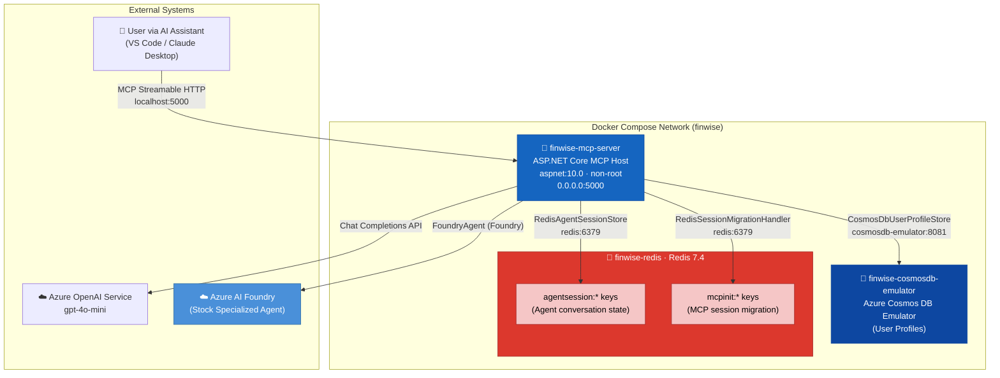

---

## 2. Docker Compose Service Architecture

New in v0.3.1. Shows the three-service Docker Compose stack with health check dependencies, port mappings, and resource limits.

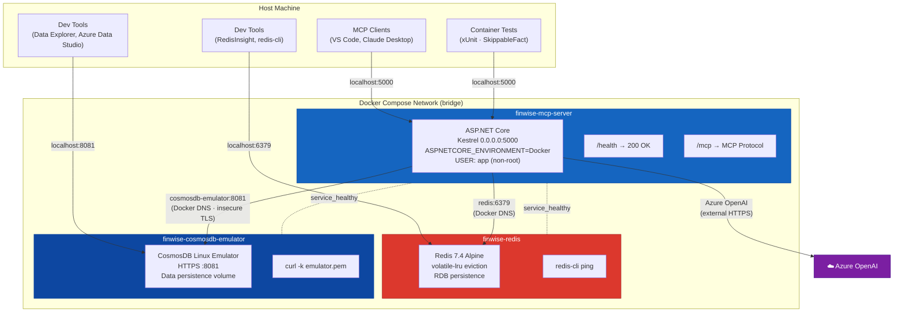

---

## 3. Dual Deployment Modes

New in v0.3.1. Compares the two supported deployment modes — full Docker stack vs. .NET host process with Docker infrastructure.

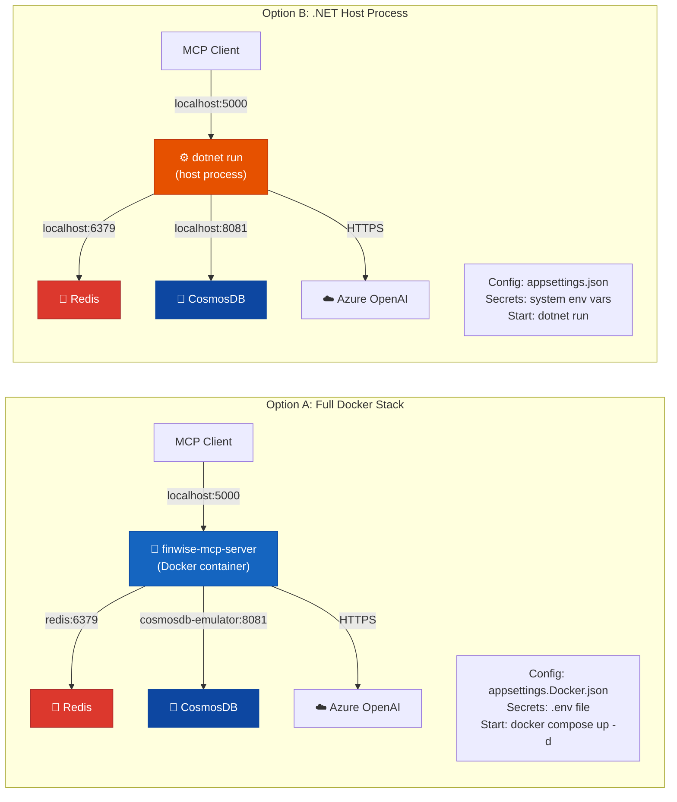

---

## 4. Docker Image Build Pipeline

New in v0.3.1. Shows the multi-stage Dockerfile producing a minimal runtime image.

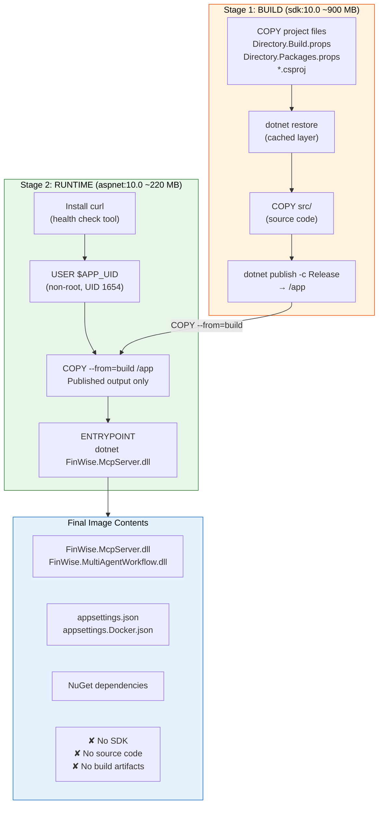

---

## 5. Configuration & Environment Flow

New in v0.3.1. Shows how configuration is layered for the Docker environment.

```mermaid
graph LR
    subgraph Sources["Configuration Sources"]
        Base["appsettings.json<br/>────────────────<br/>Kestrel: localhost:5000<br/>Redis: localhost:6379<br/>CosmosDb: localhost:8081"]
        Docker["appsettings.Docker.json<br/>────────────────────<br/>Kestrel: 0.0.0.0:5000<br/>Redis: redis:6379<br/>CosmosDb: cosmosdb-emulator:8081"]
        EnvFile[".env (git-ignored)<br/>────────────────<br/>AZURE_OPENAI_ENDPOINT<br/>AZURE_OPENAI_API_KEY<br/>AZURE_OPENAI_DEPLOYMENT_NAME<br/>STOCK_AGENT_* (optional)"]
    end

    subgraph Compose["docker-compose.yml"]
        ComposeEnv["environment:<br/>ASPNETCORE_ENVIRONMENT=Docker<br/>AZURE_OPENAI_*=$&#123;...&#125;"]
    end

    subgraph Container["finwise-mcp-server Container"]
        ASPConfig["ASP.NET Core Configuration<br/>(merged, later overrides earlier)"]
    end

    Base -->|"baked into image"| ASPConfig
    Docker -->|"activated by<br/>ASPNETCORE_ENVIRONMENT=Docker"| ASPConfig
    EnvFile -->|"interpolated by Compose"| ComposeEnv
    ComposeEnv -->|"injected as env vars"| ASPConfig

    style Base fill:#FFF3E0,stroke:#E65100,color:#000
    style Docker fill:#E8F5E9,stroke:#2E7D32,color:#000
    style EnvFile fill:#FCE4EC,stroke:#C62828,color:#000
    style Container fill:#E3F2FD,stroke:#1565C0,color:#000
```

---

## 6. System Architecture Overview

Evolved from v0.3. The McpServer now runs inside a Docker container. The internal component structure is unchanged; what's new is the container boundary and the Docker DNS-based connections to Redis and CosmosDB.

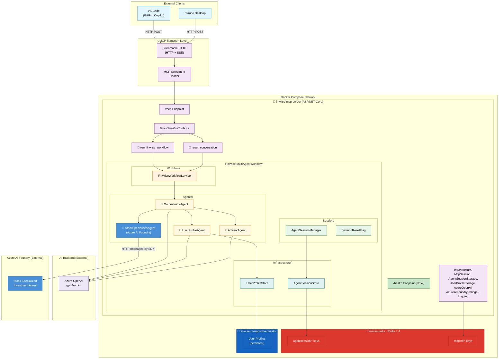

---

## 7. Agent Workflow — Hub-and-Spoke with Profile Gate

Unchanged from v0.3. Docker does not affect agent orchestration — all container concerns are handled at the infrastructure layer.

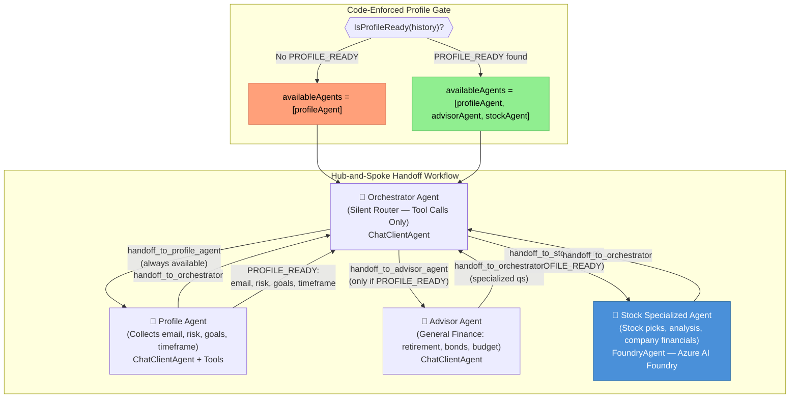

---

## 8. Orchestrator Routing Decision Tree

Unchanged from v0.3.

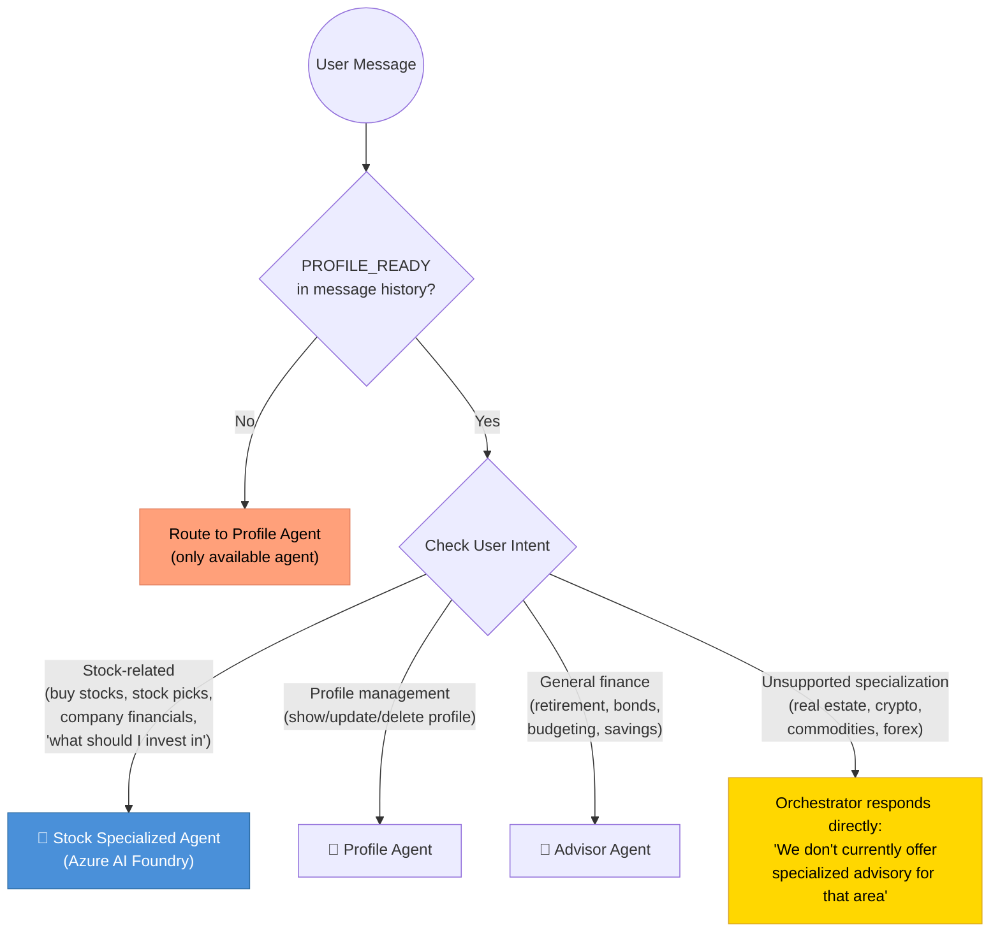

---

## 9. Session Lifecycle

Unchanged from v0.3. The session flow is identical whether the server runs as a Docker container or a host process — the AgentSessionStore connects to Redis via a connection string, which differs only in hostname (`redis:6379` vs. `localhost:6379`).

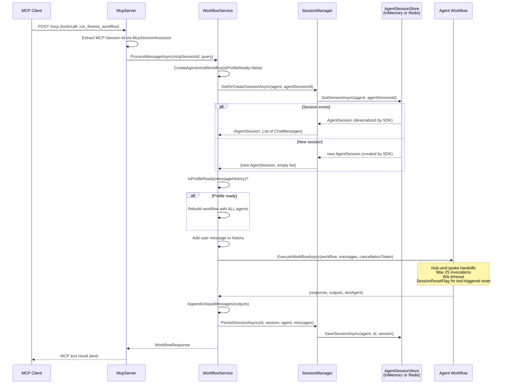

---

## 10. CosmosDB Emulator — Dual-Access Pattern

New in v0.3.1. Illustrates the networking challenge and the `LimitToEndpoint` design decision that enables both host and container clients to reach the same emulator.

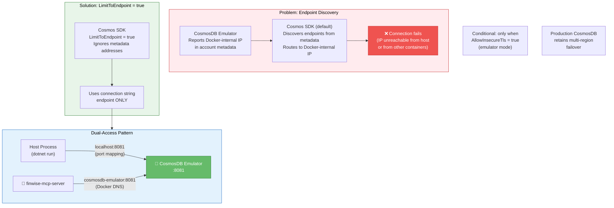

---

## 11. Test Architecture — Shared Base Pattern

New in v0.3.1. Shows the shared test base class library and the two test project categories.

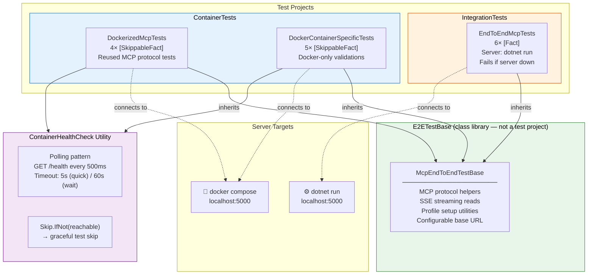

---

## 12. Test Pyramid

New in v0.3.1. Shows the full test pyramid with the container test layer added.

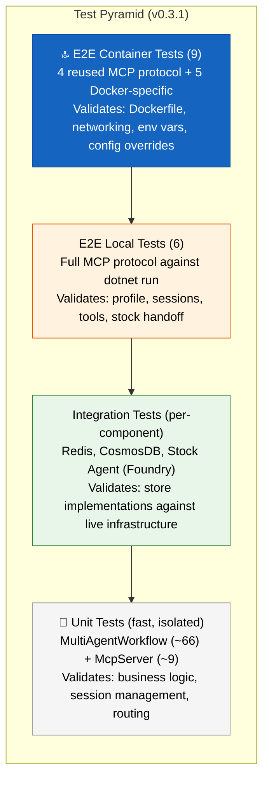

---

## 13. Class Diagram — v0.3.1 Changes Highlighted

Evolved from v0.3. Key changes: `StockSpecializedAgentFactory` now returns `FoundryAgent` (via two-step resolution from `Microsoft.Agents.AI.Foundry`) instead of `AIAgent` directly. The `/health` endpoint was added for Docker support. The core class structure is otherwise unchanged.

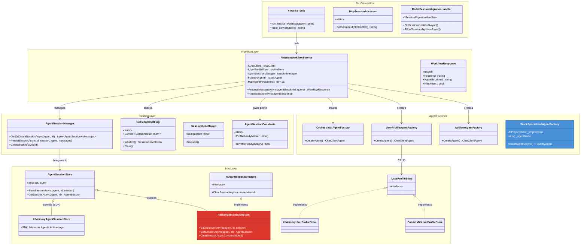

---

## 14. Stock Specialized Agent — Foundry Integration Detail

Updated from v0.3. The MAF 1.0 GA upgrade changed the agent resolution pattern from a single-step convenience method to an explicit two-step flow: fetch the `ProjectsAgentRecord` from the Azure SDK, then adapt it into a `FoundryAgent` via the bridge package. The Foundry agent still runs in the cloud and is accessed via HTTP regardless of deployment mode.

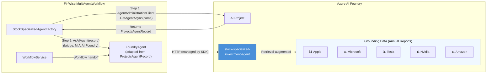

---

## 15. End-to-End Request Flow — Stock Advice (Containerized)

Evolved from v0.3. Shows the same request flow now originating from a containerized MCP server.

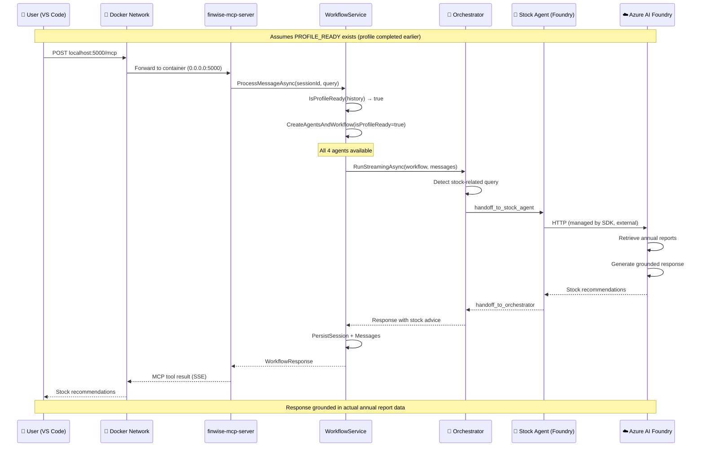

---

## Diagram Index

| # | Diagram | Status | Description |
|---|---------|--------|-------------|
| 1 | System Context | **Updated** | Docker Compose boundary wrapping all three services |
| 2 | Docker Compose Service Architecture | **New** | Three-service stack with health dependencies and port mappings |
| 3 | Dual Deployment Modes | **New** | Option A (full Docker) vs. Option B (.NET host process) |
| 4 | Docker Image Build Pipeline | **New** | Multi-stage Dockerfile: build → runtime |
| 5 | Configuration & Environment Flow | **New** | appsettings layering + .env → Compose → container |
| 6 | System Architecture Overview | **Updated** | Components now inside Docker container boundary |
| 7 | Agent Workflow — Hub-and-Spoke | Unchanged | Profile gate + hub-and-spoke handoffs |
| 8 | Orchestrator Routing Decision Tree | Unchanged | Intent-based routing with profile gate |
| 9 | Session Lifecycle | Unchanged | SDK AgentSessionStore + Redis (same flow, different hostname) |
| 10 | CosmosDB Dual-Access Pattern | **New** | LimitToEndpoint design decision for emulator networking |
| 11 | Test Architecture — Shared Base | **New** | E2ETestBase + IntegrationTests + ContainerTests |
| 12 | Test Pyramid | **New** | Full test layers including container E2E |
| 13 | Class Diagram | **Updated** | `FoundryAgent` replaces `AIAgent` in StockSpecializedAgentFactory |
| 14 | Stock Agent — Foundry Integration | **Updated** | Two-step resolution: `ProjectsAgentRecord` → `FoundryAgent` (MAF 1.0 GA) |
| 15 | E2E Request Flow — Stock Advice | **Updated** | Shows Docker network hop in containerized flow |
