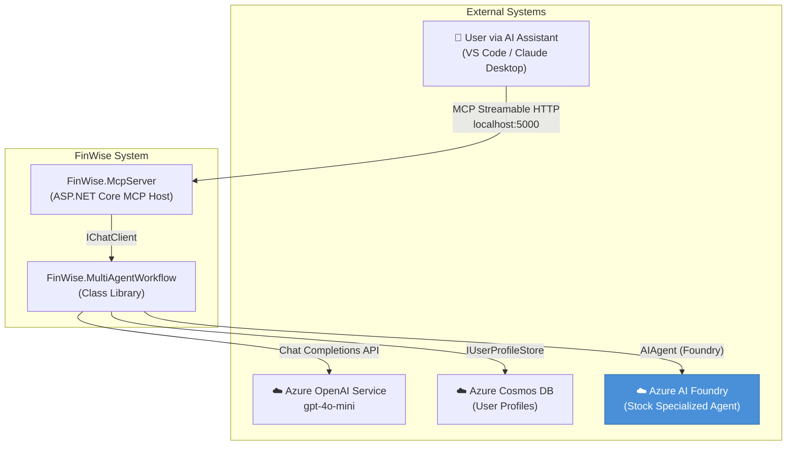
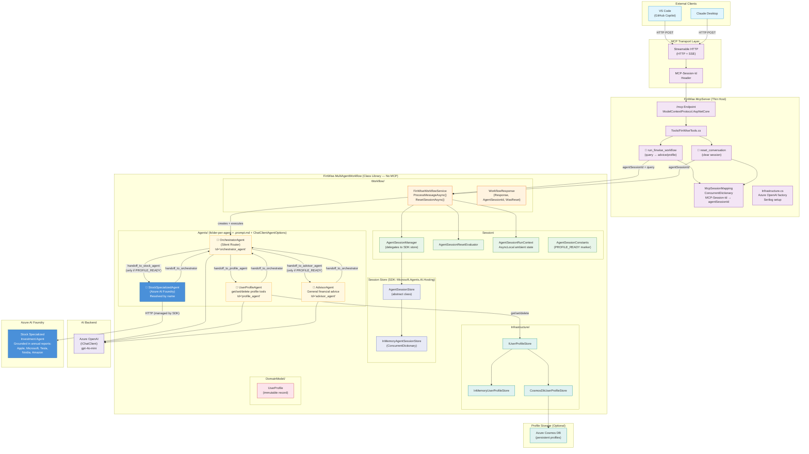
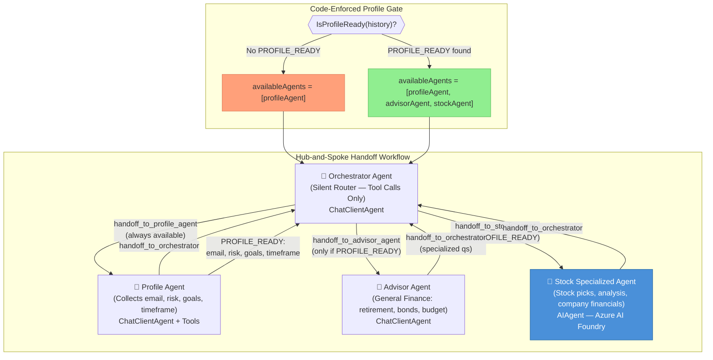
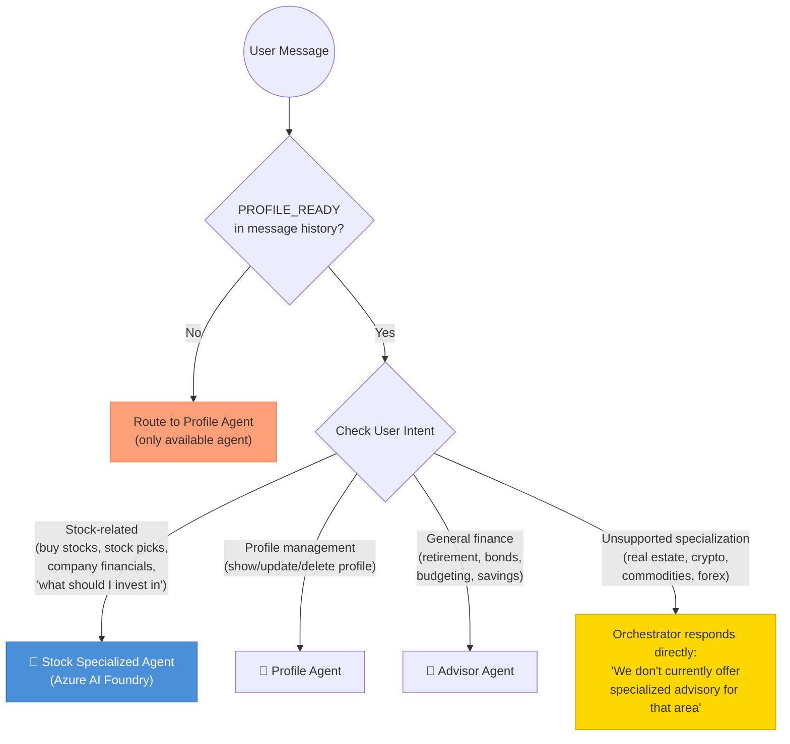
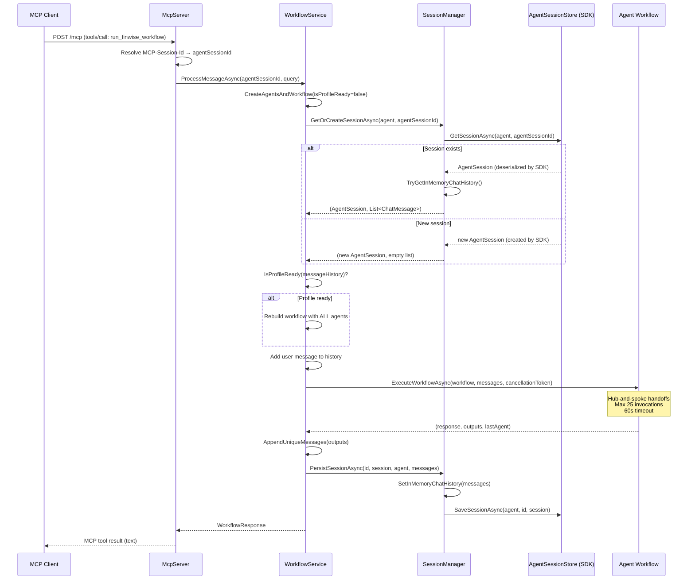
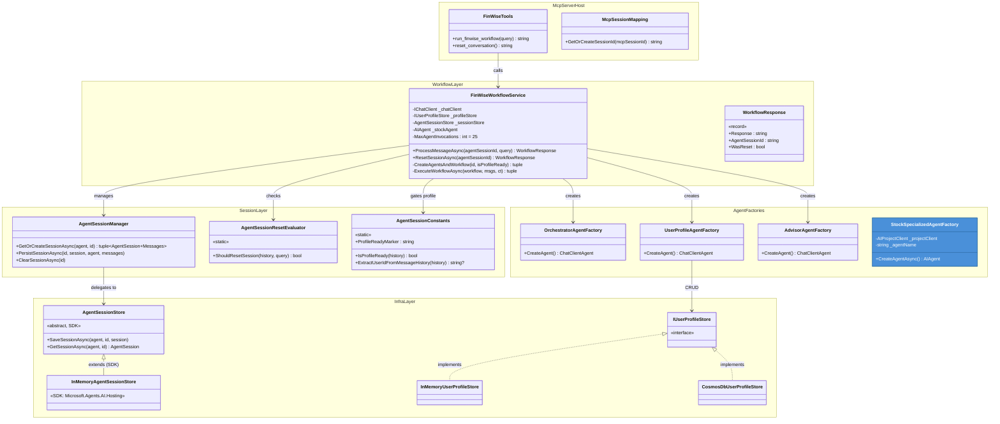
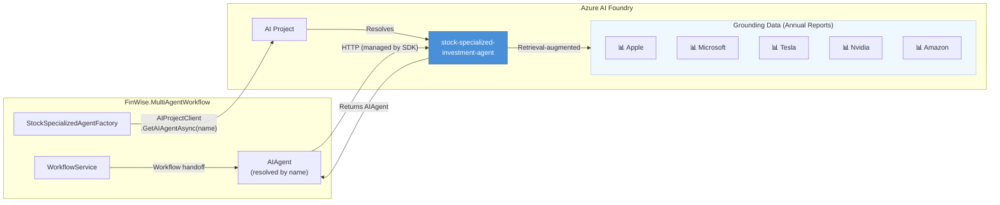
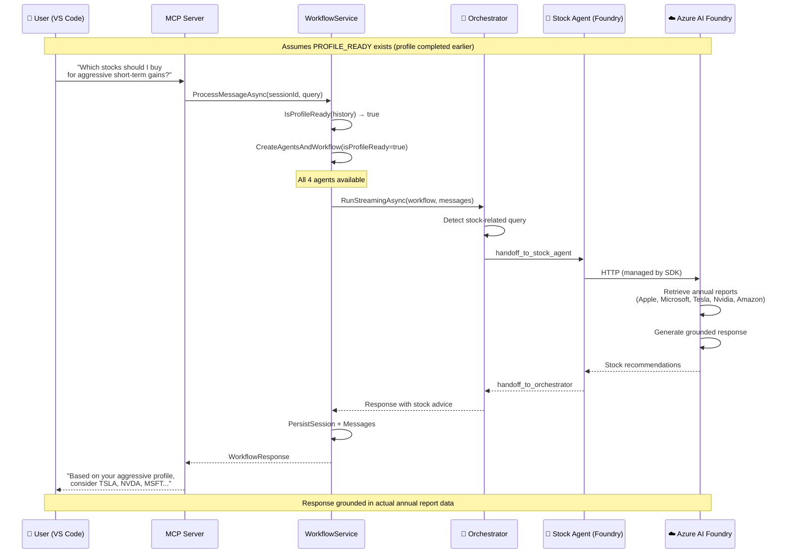

# FinWise Architecture — Mermaid Diagrams (v0.3)

**Date:** March 15, 2026  
**Status:** In Progress  
**Previous Version:** [v0.2 Mermaid Diagrams](FinWise-Architecture-Mermaid-Diagram-v0.2.md)

---

## 1. System Context Diagram

---

## 1.1 System Architecture Overview

---

## 2. Agent Workflow — Hub-and-Spoke with Profile Gate

---

## 3. Orchestrator Routing Decision Tree

---

## 4. Session Lifecycle (v0.3 — SDK AgentSessionStore)

---

## 5. Class Diagram — v0.3 Changes Highlighted

---

## 6. Stock Specialized Agent — Foundry Integration Detail

---

## 7. End-to-End Request Flow — Stock Advice

