# FinWise Architecture — Mermaid Diagrams (v1.0.0)

**Date:** April 17, 2026  
**Status:** Implemented  
**Previous Version:** [v0.3.1 Mermaid Diagrams](FinWise-Architecture-Mermaid-Diagram-v0.3.1.md)

---

## 1. System Context Diagram

Updated to show Azure cloud data stores as alternatives to local Docker services, and the Azure Container Apps deployment as the fully cloud-native option. The Docker image is published to Docker Hub.

```mermaid
graph TB
    subgraph External["External Systems"]
        User["👤 User via AI Assistant<br/>(VS Code / Claude Desktop)"]
        AzureOAI["☁️ Azure OpenAI Service<br/>gpt-4o-mini"]
        Foundry["☁️ Azure AI Foundry<br/>(Stock Specialized Agent)"]
    end

    subgraph DockerCompose["Docker Compose Network (finwise) — Local"]
        McpContainer["🐳 finwise-mcp-server<br/>ASP.NET Core MCP Host<br/>aspnet:10.0 · non-root<br/>0.0.0.0:5000"]

        subgraph Redis["🐳 finwise-redis · Redis 7.4"]
            RedisAgentSessions["agentsession:* keys<br/>(Agent conversation state)"]
            RedisMcpInit["mcpinit:* keys<br/>(MCP session migration)"]
        end

        CosmosDB["🐳 finwise-cosmosdb-emulator<br/>Azure Cosmos DB Emulator<br/>(User Profiles)"]
    end

    subgraph AzureCloud["☁️ Azure Cloud"]
        ACA["☁️ Azure Container Apps<br/>finwise-mcp-server-container-app<br/>HTTPS · 1–5 replicas · East US 2"]
        AzureRedis["Azure Managed Redis<br/>Balanced B0 · East US<br/>Port 10000 · Plaintext"]
        AzureCosmos["Azure Cosmos DB<br/>Serverless · NoSQL API<br/>FinWise / UserProfiles"]
    end

    subgraph DockerHub["Docker Hub"]
        Image["finwiseproject/<br/>finwise-mcp-server:1.0.0"]
    end

    User -->|"MCP Streamable HTTP<br/>localhost:5000"| McpContainer
    User -->|"MCP over HTTPS<br/>*.azurecontainerapps.io/mcp"| ACA
    McpContainer -->|"Chat Completions API"| AzureOAI
    McpContainer -->|"FoundryAgent (Foundry)"| Foundry
    McpContainer -->|"RedisAgentSessionStore"| RedisAgentSessions
    McpContainer -->|"RedisSessionMigrationHandler"| RedisMcpInit
    McpContainer -->|"CosmosDbUserProfileStore"| CosmosDB

    McpContainer -.->|"OR: Azure Managed Redis<br/>*.redis.azure.net:10000"| AzureRedis
    McpContainer -.->|"OR: Azure Cosmos DB<br/>*.documents.azure.com:443"| AzureCosmos

    Image -->|"Pulled by"| ACA
    ACA -->|"Azure backbone"| AzureRedis
    ACA -->|"Azure backbone"| AzureCosmos
    ACA -->|"Chat Completions API"| AzureOAI
    ACA -->|"FoundryAgent"| Foundry

    style McpContainer fill:#1565C0,stroke:#0D47A1,color:#fff
    style Foundry fill:#4A90D9,stroke:#2E6DA4,color:#fff
    style Redis fill:#DC382D,stroke:#A52A2A,color:#fff
    style RedisAgentSessions fill:#F5C6C6,stroke:#A52A2A,color:#000
    style RedisMcpInit fill:#F5C6C6,stroke:#A52A2A,color:#000
    style CosmosDB fill:#0D47A1,stroke:#0D47A1,color:#fff
    style AzureRedis fill:#DC382D,stroke:#A52A2A,color:#fff
    style AzureCosmos fill:#0D47A1,stroke:#0D47A1,color:#fff
    style AzureCloud fill:#E3F2FD,stroke:#1565C0,color:#000
    style ACA fill:#4A148C,stroke:#7B1FA2,color:#fff
    style Image fill:#FFF3E0,stroke:#E65100,color:#000
```

---

## 2. Four Deployment Modes

Updated from v0.3.1 (was 2 modes). Shows the four supported deployment modes including the new Azure-connected mode and the fully cloud-native Azure Container Apps deployment.

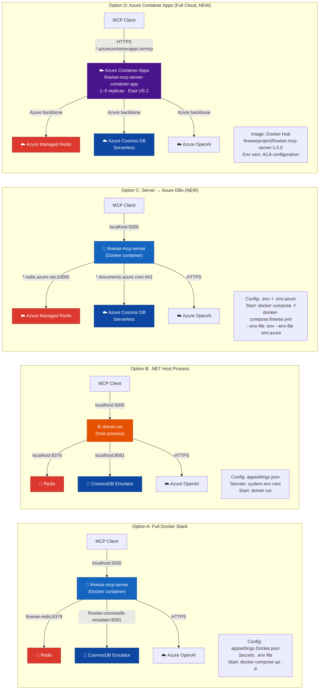

---

## 3. Three-File Docker Compose Architecture

New in v1.0.0. Shows the three compose files, their relationships, and how they enable the three deployment modes.

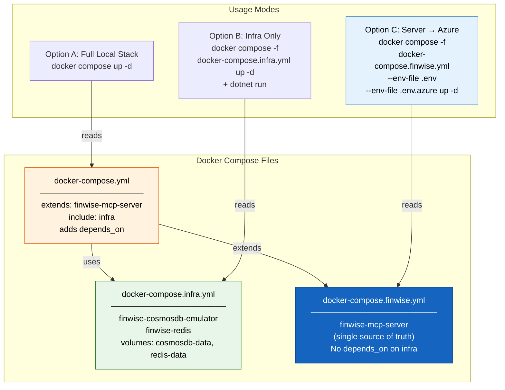

---

## 4. Configuration & Environment Flow

Updated from v0.3.1. Shows the full layered configuration precedence chain including `FINWISE_*` env vars, `ForceInMemoryData` master toggle, and the layered `.env` architecture.

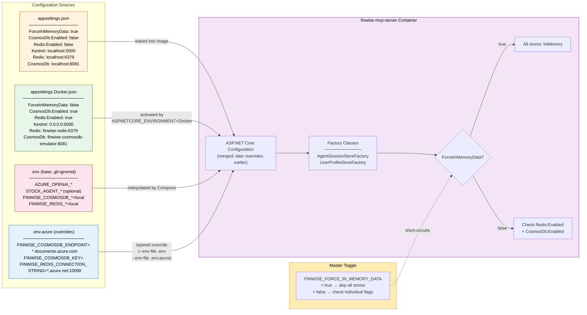

---

## 5. Docker Compose Service Architecture

Updated from v0.3.1. Shows the three-service Docker Compose stack with health check dependencies and dual data store targets.

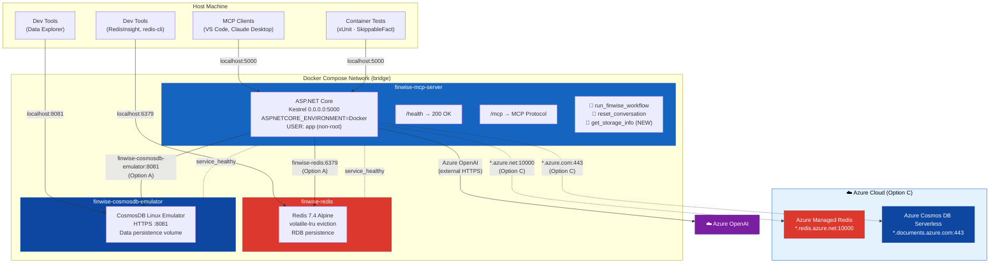

---

## 6. Docker Image Build Pipeline

Unchanged from v0.3.1. Multi-stage Dockerfile producing a minimal runtime image.

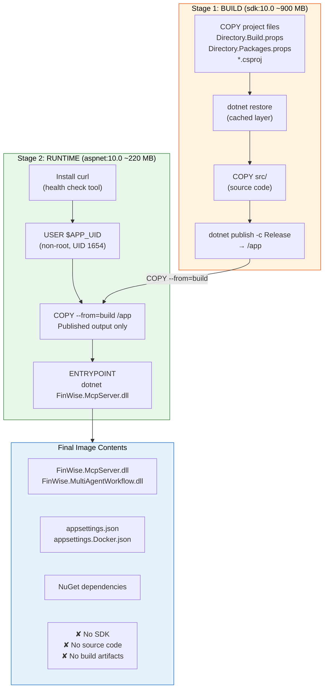

---

## 7. System Architecture Overview

Updated from v0.3.1. Shows three MCP tools (added `get_storage_info`), Azure cloud alternatives for Redis and CosmosDB, and the factory-based store selection.

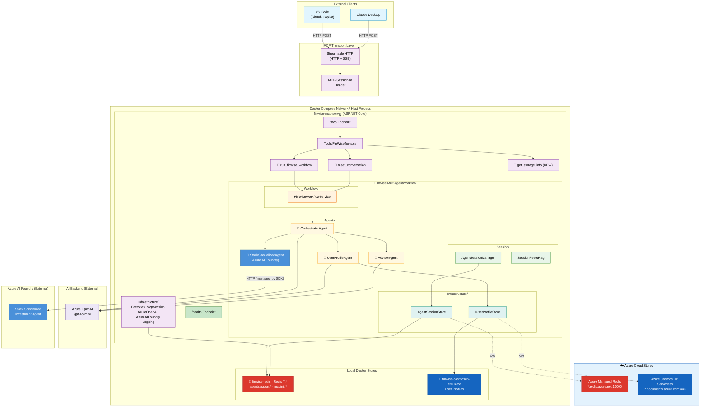

---

## 8. Data Store Selection Flow

New in v1.0.0. Shows the factory-based decision tree that selects between in-memory, local, and Azure data stores at startup.

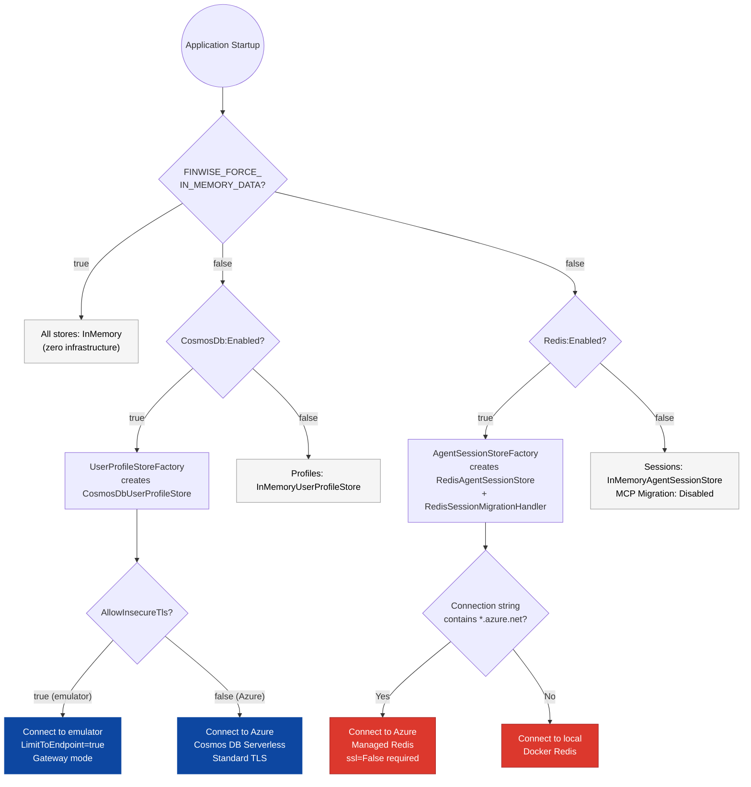

---

## 9. Agent Workflow — Hub-and-Spoke with Profile Gate

Unchanged from v0.3.1. Data store selection does not affect agent orchestration.

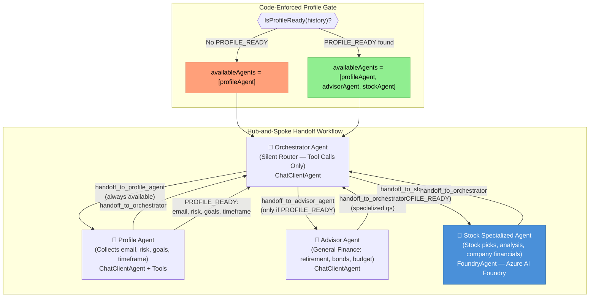

---

## 10. Orchestrator Routing Decision Tree

Unchanged from v0.3.1.

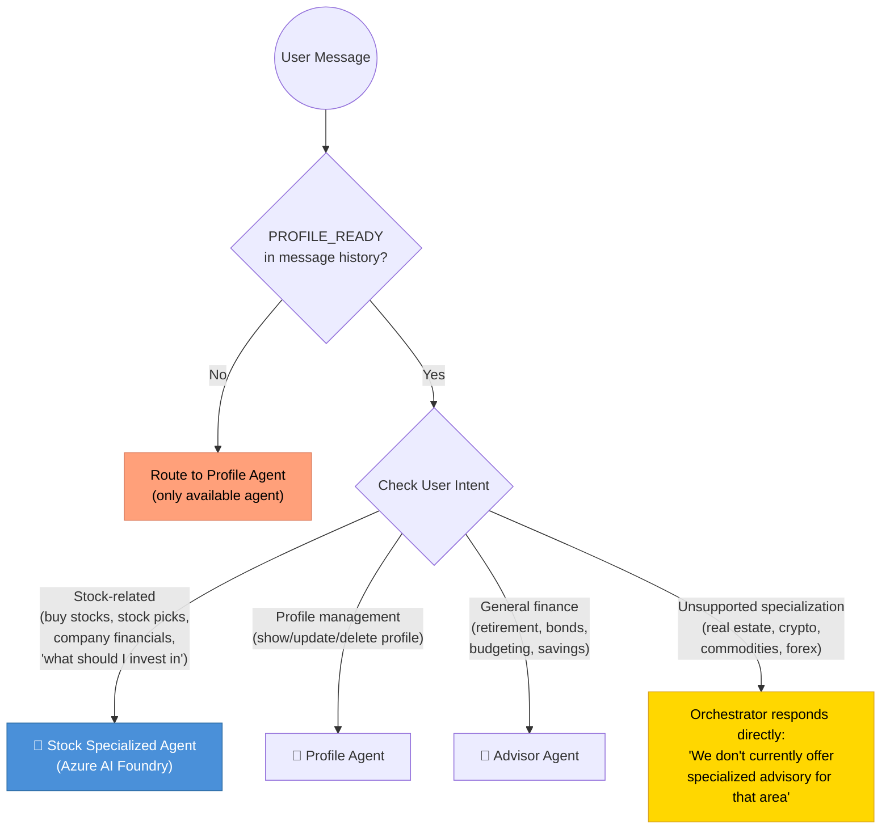

---

## 11. Session Lifecycle

Unchanged from v0.3.1. The session flow is identical regardless of whether Redis is local Docker or Azure Managed Redis.

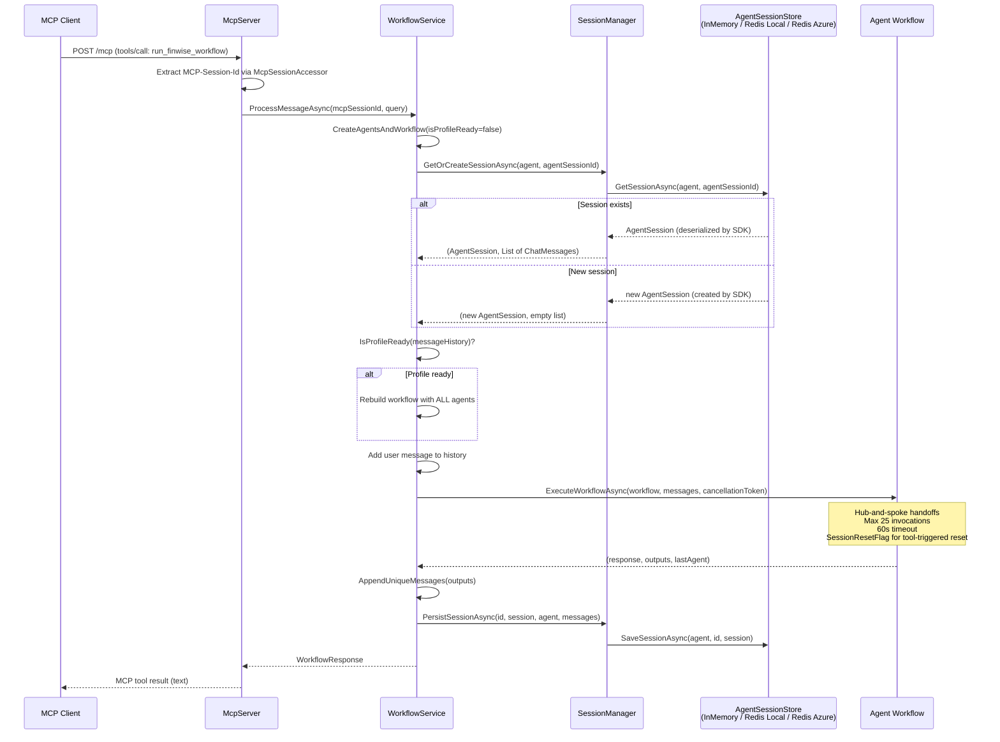

---

## 12. Scale-Out Architecture (Azure Container Apps)

New in v1.0.0. Shows the proven 5-replica stateless scale-out pattern deployed to Azure Container Apps with the Docker image from Docker Hub.

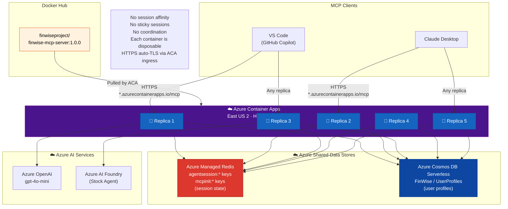

---

## 13. CosmosDB Dual-Access Pattern

Unchanged from v0.3.1 for emulator. For Azure Cosmos DB Serverless, `LimitToEndpoint` is not needed — standard endpoint discovery works.

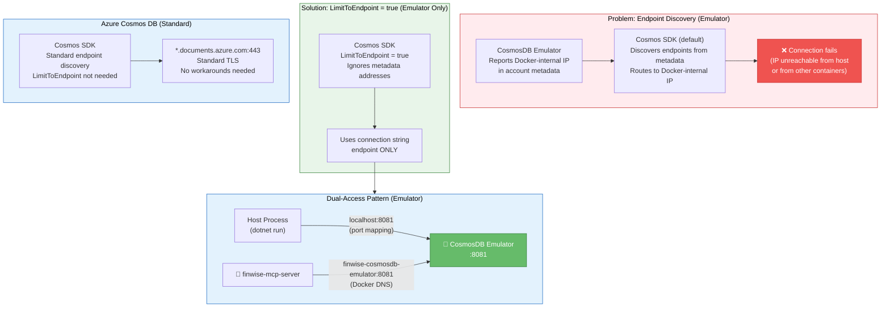

---

## 14. Azure Managed Redis — Connection Pattern

New in v1.0.0. Shows the SSL auto-detection challenge and the required `ssl=False` workaround for Plaintext instances.

```mermaid
graph TB
    subgraph Challenge["Challenge: SSL Auto-Detection"]
        Hostname["Connection string:<br/>*.redis.azure.net:10000"]
        AutoDetect["StackExchange.Redis<br/>detects *.azure.net<br/>→ auto-enables SSL"]
        TLSFail["❌ TLS handshake fails<br/>(instance is Plaintext)"]

        Hostname --> AutoDetect --> TLSFail
    end

    subgraph Fix["Fix: Explicit ssl=False"]
        ConnStr["*.redis.azure.net:10000,<br/>password=key,<br/>ssl=False,<br/>abortConnect=False"]
        Works["✅ Connection succeeds<br/>(Plaintext protocol)"]

        ConnStr --> Works
    end

    subgraph Evolution["Production Evolution Path"]
        Step1["Current (POC)<br/>Plaintext + Access Keys<br/>ssl=False"]
        Step2["Step 1<br/>TLS + Access Keys<br/>ssl=True"]
        Step3["Step 2<br/>TLS + Entra ID<br/>Managed Identity"]

        Step1 --> Step2 --> Step3
    end

    style Challenge fill:#FFEBEE,stroke:#C62828,color:#000
    style Fix fill:#E8F5E9,stroke:#2E7D32,color:#000
    style TLSFail fill:#EF5350,stroke:#C62828,color:#fff
    style Works fill:#66BB6A,stroke:#2E7D32,color:#fff
    style Evolution fill:#E3F2FD,stroke:#1565C0,color:#000
```

---

## 15. Test Architecture — Full Picture

Updated from v0.3.1. Shows xUnit Trait categorization, target-agnostic integration tests, and the new `DockerEnvVarConfigTests`.

```mermaid
graph TB
    subgraph TestProjects["Test Projects"]
        subgraph UnitTests["Unit Tests · Category=Unit"]
            MAW["MultiAgentWorkflow.UnitTests<br/>Workflow, Session, Agents,<br/>Stores, Deduplication"]
            MCP_U["McpServer.UnitTests<br/>McpSession, MigrationHandler"]
        end

        subgraph Integration["Integration · Category=Integration"]
            E2E["EndToEndMcpTests<br/>8× [Fact]<br/>Server: dotnet run"]
            CosmosInt["CosmosDb.IntegrationTests<br/>13× [Fact]<br/>Target: emulator OR Azure"]
            RedisInt["Redis.IntegrationTests<br/>12× [SkippableFact]<br/>Target: local OR Azure"]
            StockInt["StockAgent.IntegrationTests<br/>4× [SkippableFact]"]
        end

        subgraph Container["Container · Category=Container"]
            Dockerized["DockerizedMcpTests<br/>4× [SkippableFact]"]
            DockerSpecific["DockerContainerSpecificTests<br/>5× [SkippableFact]"]
            EnvVar["DockerEnvVarConfigTests (NEW)<br/>2× [SkippableFact]"]
        end
    end

    subgraph SharedLib["E2ETestBase (class library)"]
        Base["McpEndToEndTestBase<br/>MCP protocol helpers<br/>SSE streaming reads<br/>Configurable base URL"]
    end

    E2E -->|"inherits"| Base
    Dockerized -->|"inherits"| Base

    subgraph Targets["Server Targets"]
        LocalServer["⚙️ dotnet run<br/>localhost:5000"]
        DockerServer["🐳 docker compose<br/>localhost:5000"]
    end

    subgraph DataTargets["Data Store Targets"]
        Emulator["🐳 Local Emulators<br/>localhost:8081 / :6379"]
        Azure["☁️ Azure Cloud<br/>*.azure.com / *.azure.net"]
    end

    E2E -.->|"connects to"| LocalServer
    Dockerized -.->|"connects to"| DockerServer
    DockerSpecific -.->|"connects to"| DockerServer
    EnvVar -.->|"connects to"| DockerServer

    CosmosInt -.->|"env vars"| Emulator
    CosmosInt -.->|"env vars"| Azure
    RedisInt -.->|"env vars"| Emulator
    RedisInt -.->|"env vars"| Azure

    subgraph RunSettings[".runsettings Files"]
        Default["test.runsettings<br/>(minimal)"]
        DockerLocal["test.docker-local.runsettings<br/>(all FINWISE_* env vars)"]
    end

    style UnitTests fill:#F5F5F5,stroke:#9E9E9E,color:#000
    style Integration fill:#FFF3E0,stroke:#E65100,color:#000
    style Container fill:#E3F2FD,stroke:#1565C0,color:#000
    style SharedLib fill:#E8F5E9,stroke:#2E7D32,color:#000
    style DataTargets fill:#F3E5F5,stroke:#7B1FA2,color:#000
    style RunSettings fill:#FFECB3,stroke:#FF8F00,color:#000
```

---

## 16. Test Pyramid

Updated from v0.3.1. Expanded test counts and new env var config layer.

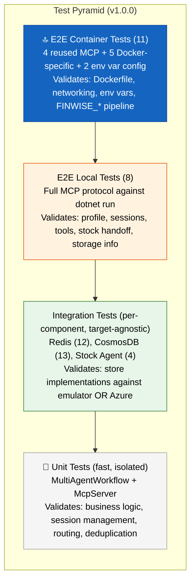

---

## 17. Class Diagram — v1.0.0 Changes Highlighted

Updated from v0.3.1. Key changes: `get_storage_info` tool added to `FinWiseTools`, factory classes now include `FINWISE_*` env var override logic, `CosmosDbUserProfileStore` no longer specifies throughput.

```mermaid
classDiagram
    direction TB

    namespace McpServerHost {
        class FinWiseTools {
            +run_finwise_workflow(query) string
            +reset_conversation() string
            +get_storage_info() string [NEW]
        }
        class McpSessionAccessor {
            «static»
            +GetSessionId(httpContext) string
        }
        class RedisSessionMigrationHandler {
            «ISessionMigrationHandler»
            +OnSessionInitializedAsync()
            +AllowSessionMigrationAsync()
        }
        class AgentSessionStoreFactory {
            «static» [UPDATED]
            +CreateSessionStoreAsync(config) tuple
            -ApplyEnvironmentOverrides(options)
            -IsForceInMemoryDataEnabled(config) bool
        }
        class UserProfileStoreFactory {
            «static» [UPDATED]
            +CreateProfileStore(config) IUserProfileStore
            -ApplyEnvironmentOverrides(options)
            -IsForceInMemoryDataEnabled(config) bool
        }
    }

    namespace WorkflowLayer {
        class FinWiseWorkflowService {
            -IChatClient _chatClient
            -IUserProfileStore _profileStore
            -AgentSessionManager _sessionManager
            -AIAgent? _stockAgent
            -MaxAgentInvocations : int = 25
            +ProcessMessageAsync(agentSessionId, query) WorkflowResponse
            +ResetSessionAsync(agentSessionId)
        }
        class WorkflowResponse {
            «record»
            +Response : string
            +AgentSessionId : string
            +WasReset : bool
        }
    }

    namespace AgentFactories {
        class OrchestratorAgentFactory {
            +CreateAgent() ChatClientAgent
        }
        class UserProfileAgentFactory {
            +CreateAgent() ChatClientAgent
        }
        class AdvisorAgentFactory {
            +CreateAgent() ChatClientAgent
        }
        class StockSpecializedAgentFactory {
            -AIProjectClient _projectClient
            -string _agentName
            +CreateAgentAsync() AIAgent
        }
    }

    namespace SessionLayer {
        class AgentSessionManager {
            +GetOrCreateSessionAsync(agent, id) tuple~AgentSession+Messages~
            +PersistSessionAsync(id, session, agent, messages)
            +ClearSessionAsync(id)
        }
        class SessionResetFlag {
            «static»
            +Current : SessionResetToken?
            +Initialize() SessionResetToken
            +Clear()
        }
        class AgentSessionConstants {
            «static»
            +ProfileReadyMarker : string
            +IsProfileReady(history) bool
        }
    }

    namespace InfraLayer {
        class AgentSessionStore {
            «abstract, SDK»
            +SaveSessionAsync(agent, id, session)
            +GetSessionAsync(agent, id) AgentSession
        }
        class InMemoryAgentSessionStore {
            «SDK: Microsoft.Agents.AI.Hosting»
        }
        class RedisAgentSessionStore {
            +SaveSessionAsync(agent, id, session)
            +GetSessionAsync(agent, id) AgentSession
            +ClearSessionAsync(conversationId)
        }
        class IClearableSessionStore {
            «interface»
            +ClearSessionAsync(conversationId)
        }
        class IUserProfileStore {
            «interface»
        }
        class InMemoryUserProfileStore
        class CosmosDbUserProfileStore {
            [UPDATED: no throughput param]
        }
        class RedisOptions {
            +Enabled : bool
            +ConnectionString : string
            +SessionTtlMinutes : int
        }
        class CosmosDbOptions {
            +Enabled : bool
            +Endpoint : string
            +Key : string
            +DatabaseName : string
            +ContainerName : string
            +AllowInsecureTls : bool
        }
    }

    %% Wiring
    FinWiseTools --> FinWiseWorkflowService : calls
    FinWiseWorkflowService --> OrchestratorAgentFactory : creates
    FinWiseWorkflowService --> UserProfileAgentFactory : creates
    FinWiseWorkflowService --> AdvisorAgentFactory : creates
    FinWiseWorkflowService --> AgentSessionManager : manages
    FinWiseWorkflowService --> SessionResetFlag : checks
    FinWiseWorkflowService --> AgentSessionConstants : gates profile
    AgentSessionManager --> AgentSessionStore : delegates to
    AgentSessionStore <|-- InMemoryAgentSessionStore : extends (SDK)
    AgentSessionStore <|-- RedisAgentSessionStore : extends
    IClearableSessionStore <|.. RedisAgentSessionStore : implements
    UserProfileAgentFactory --> IUserProfileStore : CRUD
    IUserProfileStore <|.. InMemoryUserProfileStore : implements
    IUserProfileStore <|.. CosmosDbUserProfileStore : implements
    AgentSessionStoreFactory --> AgentSessionStore : creates
    AgentSessionStoreFactory --> RedisOptions : reads
    UserProfileStoreFactory --> IUserProfileStore : creates
    UserProfileStoreFactory --> CosmosDbOptions : reads

    style StockSpecializedAgentFactory fill:#4A90D9,stroke:#2E6DA4,color:#fff
    style RedisAgentSessionStore fill:#DC382D,stroke:#A52A2A,color:#fff
    style AgentSessionStoreFactory fill:#FFF3E0,stroke:#E65100,color:#000
    style UserProfileStoreFactory fill:#FFF3E0,stroke:#E65100,color:#000
```

---

## 18. Stock Specialized Agent — Foundry Integration Detail

Unchanged from v0.3.1.

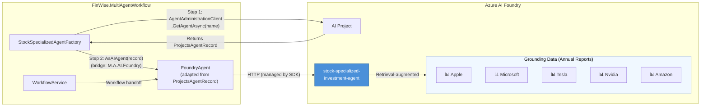

---

## 19. End-to-End Request Flow — Stock Advice (Azure Container Apps)

Updated from v0.3.1. Shows the request flow through Azure Container Apps with HTTPS ingress, connecting to Azure cloud data stores.

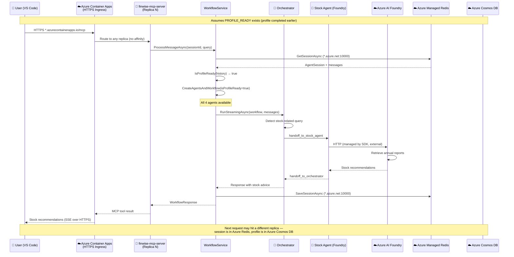

---

## 20. Layered .env Architecture

New in v1.0.0. Shows the `.env` file layering pattern that enables switching between local and Azure data stores.

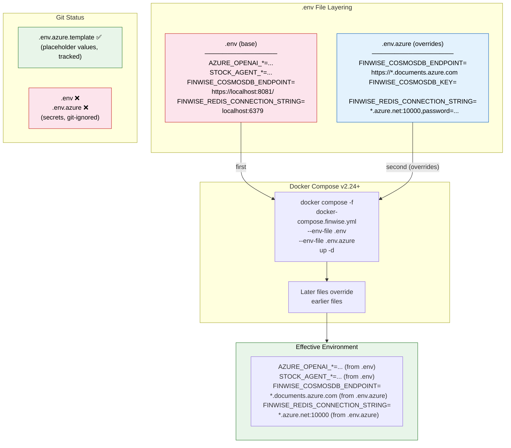

---

## Diagram Index

| # | Diagram | Status | Description |
|---|---------|--------|-------------|
| 1 | System Context | **Updated** | Added Azure cloud stores, Azure Container Apps, Docker Hub image |
| 2 | Four Deployment Modes | **Updated** | Was 2 modes — added Option C (server → Azure DBs) + Option D (Azure Container Apps) |
| 3 | Three-File Docker Compose Architecture | **New** | `finwise.yml` + `infra.yml` + `docker-compose.yml` relationships |
| 4 | Configuration & Environment Flow | **Updated** | Full layered config with `FINWISE_*` env vars and master toggle |
| 5 | Docker Compose Service Architecture | **Updated** | Added Azure cloud targets and `get_storage_info` tool |
| 6 | Docker Image Build Pipeline | Unchanged | Multi-stage Dockerfile: build → runtime |
| 7 | System Architecture Overview | **Updated** | 3 MCP tools, Azure cloud store alternatives |
| 8 | Data Store Selection Flow | **New** | Factory decision tree: ForceInMemory → check flags → select store |
| 9 | Agent Workflow — Hub-and-Spoke | Unchanged | Profile gate + hub-and-spoke handoffs |
| 10 | Orchestrator Routing Decision Tree | Unchanged | Intent-based routing with profile gate |
| 11 | Session Lifecycle | Unchanged | Same flow, store abstraction handles local/Azure transparently |
| 12 | Scale-Out Architecture | **New** | 5 replicas in Azure Container Apps → shared Azure Redis + Cosmos DB, Docker Hub image |
| 13 | CosmosDB Dual-Access Pattern | **Updated** | Added Azure Cosmos DB (no workaround needed) |
| 14 | Azure Managed Redis Connection | **New** | SSL auto-detection challenge + `ssl=False` fix |
| 15 | Test Architecture — Full Picture | **Updated** | Trait categorization, target-agnostic tests, `.runsettings` |
| 16 | Test Pyramid | **Updated** | Expanded counts, env var config tests |
| 17 | Class Diagram | **Updated** | Factory classes, `get_storage_info`, Options classes |
| 18 | Stock Agent — Foundry Integration | Unchanged | Two-step resolution via MAF 1.0 GA |
| 19 | E2E Request Flow — Stock Advice | **Updated** | Azure Container Apps HTTPS ingress, multi-replica routing |
| 20 | Layered .env Architecture | **New** | `.env` + `.env.azure` layering pattern |
